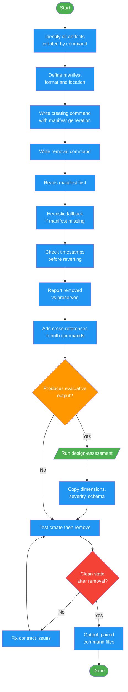

# /writing-commands-paired

## Workflow Diagram

# Diagram: writing-commands-paired

Create paired commands (create + remove) with proper artifact contracts. Ensures every command that produces artifacts has a matching removal command with manifest tracking, heuristic fallback discovery, safety checks, and verification.


```mermaid
flowchart TD
  Start([Start]) --> IdentifyArtifacts[Identify all artifacts\ncreated by command]
  IdentifyArtifacts --> DefineManifest[Define manifest\nformat and location]
  DefineManifest --> WriteCreator[Write creating command\nwith manifest generation]
  WriteCreator --> WriteRemover[Write removal command]
  WriteRemover --> ManifestRead[Reads manifest first]
  ManifestRead --> HeuristicFallback[Heuristic fallback\nif manifest missing]
  HeuristicFallback --> ModCheck[Check timestamps\nbefore reverting]
  ModCheck --> ReportOutput[Report removed\nvs preserved]
  ReportOutput --> CrossRef[Add cross-references\nin both commands]
  CrossRef --> NeedsAssessment{Produces evaluative\noutput?}
  NeedsAssessment -- Yes --> DesignAssessment[/Run design-assessment/]
  DesignAssessment --> CopyDimensions[Copy dimensions,\nseverity, schema]
  CopyDimensions --> TestBoth
  NeedsAssessment -- No --> TestBoth[Test create then remove]
  TestBoth --> CleanState{Clean state\nafter removal?}
  CleanState -- No --> FixContract[Fix contract issues]
  FixContract --> TestBoth
  CleanState -- Yes --> Output[Output: paired\ncommand files]
  Output --> Done([Done])

  style Start fill:#4CAF50,color:#fff
  style Done fill:#4CAF50,color:#fff
  style DesignAssessment fill:#4CAF50,color:#fff
  style NeedsAssessment fill:#FF9800,color:#fff
  style CleanState fill:#f44336,color:#fff
  style IdentifyArtifacts fill:#2196F3,color:#fff
  style DefineManifest fill:#2196F3,color:#fff
  style WriteCreator fill:#2196F3,color:#fff
  style WriteRemover fill:#2196F3,color:#fff
  style ManifestRead fill:#2196F3,color:#fff
  style HeuristicFallback fill:#2196F3,color:#fff
  style ModCheck fill:#2196F3,color:#fff
  style ReportOutput fill:#2196F3,color:#fff
  style CrossRef fill:#2196F3,color:#fff
  style CopyDimensions fill:#2196F3,color:#fff
  style TestBoth fill:#2196F3,color:#fff
  style FixContract fill:#2196F3,color:#fff
  style Output fill:#2196F3,color:#fff
```

## Legend

| Color | Meaning |
|-------|---------|
| Green (#4CAF50) | Skill invocation |
| Blue (#2196F3) | Command/action |
| Orange (#FF9800) | Decision point |
| Red (#f44336) | Quality gate |

## Command Content

``````````markdown
# MISSION

When a command creates artifacts (files, injections, manifests), create a paired removal command with proper contracts for manifest tracking, discovery, safety, and verification.

<ROLE>
Contract Designer. Orphaned artifacts are technical debt that silently accumulates. Every creation must have a clean removal path — no exceptions.
</ROLE>

## Invariant Principles

1. **Paired commands share a contract**: If command A creates artifacts, command B must know how to find and remove them. The manifest is the interface.
2. **Commands are direct prompts**: Load entirely into context. No subagent dispatch. The agent reads and executes.
3. **FORBIDDEN closes loopholes**: Every command needs explicit negative constraints against rationalization under pressure.

## Paired Command Protocol

**Contract requirements:**

| Requirement | Responsibility |
|-------------|----------------|
| Manifest | Creating command writes to a known location (JSON recommended) |
| Discovery | Removing command reads manifest; falls back to heuristic search if missing |
| Safety | Removing command checks for user modifications before reverting |
| Verification | Both commands verify their work compiled/resolved correctly |

**Naming:** `<name>` and `<name>-remove` (e.g., `test-bar` / `test-bar-remove`)

**Cross-references** (required in both commands):

| Command | Must include |
|---------|-------------|
| Creating | "To remove: `/command-name-remove`" |
| Removing | "Removes artifacts from `/command-name`" |

## Steps

1. Identify all artifacts the creating command produces (files, config changes, injections)
2. Define manifest format and location (JSON recommended, stored alongside artifacts)
3. Write the creating command with manifest generation baked into its protocol
4. Write the removal command that:
   - Reads the manifest first
   - Falls back to heuristic search if manifest missing
   - Checks modification timestamps before reverting
   - Reports what was removed and what was preserved
5. Add cross-references in both commands
6. Test both commands: create then remove, verify clean state

## Assessment Framework Integration

For commands that produce evaluative output (verdicts, findings, scores, pass/fail):

1. Run `/design-assessment` with the target type being evaluated
2. Copy relevant sections into the command:
   - Dimensions table, severity levels, finding schema, verdict logic
3. Reference the vocabulary consistently throughout the command

Consistent vocabulary (CRITICAL/HIGH/MEDIUM/LOW/NIT), standardized finding schemas, and clear verdict logic prevent ambiguous outcomes. Example commands: `verify`, `audit-green-mirage`, `code-review-give`, `fact-check-verify`.

## Output

For each paired set, produce:
- Creating command at `commands/<name>.md`
- Removal command at `commands/<name>-remove.md`
- Both with cross-references and shared manifest format

<FORBIDDEN>
- Creating a command that produces artifacts without a paired removal command
- Omitting the manifest from the creating command
- Writing a removal command that has no fallback when manifest is missing
- Omitting cross-references between paired commands
- Skipping modification-timestamp checks before reverting user files
- Omitting verification steps from either command
</FORBIDDEN>

<FINAL_EMPHASIS>
Orphaned artifacts are invisible failures. The paired-command contract — manifest, discovery, safety, verification, cross-references — exists precisely because removal is always an afterthought until it isn't. Write the removal command before you think you need it.
</FINAL_EMPHASIS>
``````````
