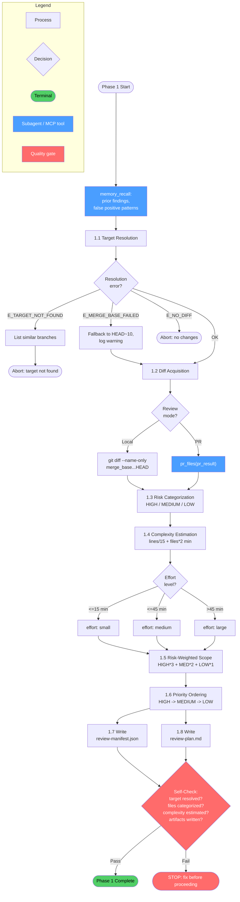
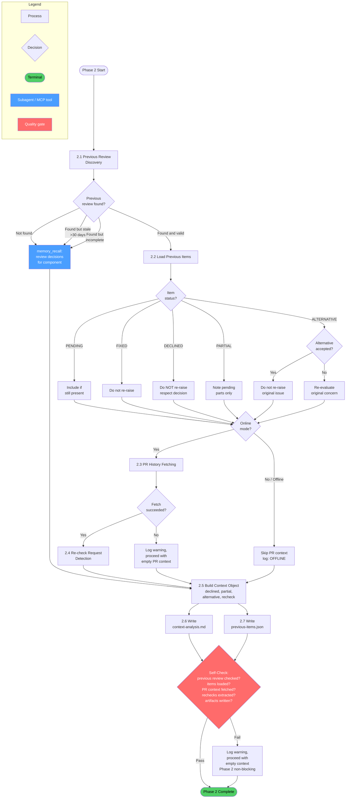
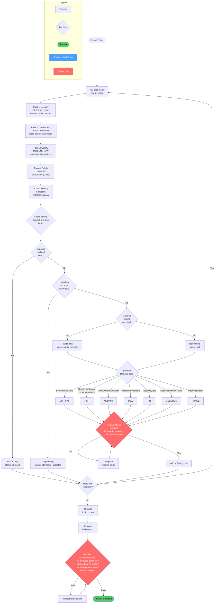
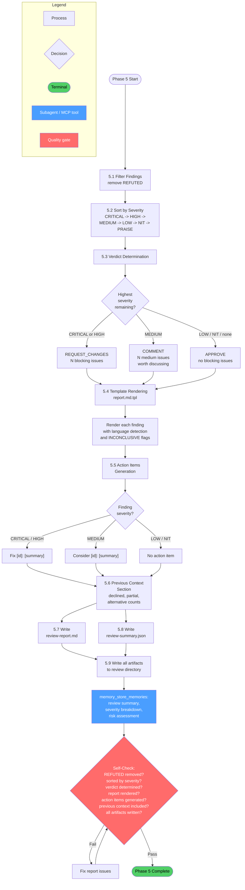
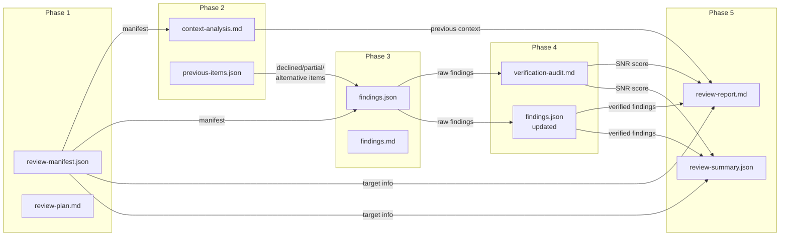

# Advanced Code Review - Workflow Diagrams

## Cross-Reference Table

| Overview Node | Detail Diagram |
|---------------|----------------|
| P1 - Strategic Planning | [Phase 1 Detail](#phase-1-strategic-planning-detail) |
| P2 - Context Analysis | [Phase 2 Detail](#phase-2-context-analysis-detail) |
| P3 - Deep Review | [Phase 3 Detail](#phase-3-deep-review-detail) |
| P4 - Verification | [Phase 4 Detail](#phase-4-verification-detail) |
| P5 - Report Generation | [Phase 5 Detail](#phase-5-report-generation-detail) |

---

## Overview

High-level phase flow with mode routing, circuit breakers, and quality gates.

```mermaid
flowchart TD
    subgraph Legend
        L1[Process]
        L2{Decision}
        L3([Terminal])
        L4[/Input/Output/]
        L5["Subagent dispatch"]
        L6["Quality gate"]
        style L5 fill:#4a9eff,color:#fff
        style L6 fill:#ff6b6b,color:#fff
        style L3 fill:#51cf66,color:#000
    end

    START([User invokes<br>advanced-code-review]) --> INPUT[/Parse inputs:<br>target, --base, --scope,<br>--offline, --continue, --json/]

    INPUT --> RESUME{--continue<br>flag?}
    RESUME -->|Yes| LOAD_SESSION[Load previous<br>review session]
    LOAD_SESSION --> P3
    RESUME -->|No| MODE{Target<br>pattern?}

    MODE -->|Branch name| LOCAL_MODE[Local mode<br>source: local files]
    MODE -->|PR number/URL| PR_MODE[PR mode<br>source: diff only]
    MODE -->|Any + --offline| OFFLINE_MODE[Offline mode<br>source: local files]

    LOCAL_MODE --> P1
    PR_MODE --> P1
    OFFLINE_MODE --> P1

    P1["Phase 1: Strategic Planning<br>/advanced-code-review-plan"]
    P1 --> SC1{"Phase 1<br>self-check?"}
    style SC1 fill:#ff6b6b,color:#fff
    SC1 -->|Fail: target<br>not resolved| CB1([Circuit breaker:<br>target resolution failed])
    SC1 -->|Fail: no diff| CB2([Circuit breaker:<br>no changes found])
    SC1 -->|Pass| P2
    style CB1 fill:#ff6b6b,color:#fff
    style CB2 fill:#ff6b6b,color:#fff

    P2["Phase 2: Context Analysis<br>/advanced-code-review-context"]
    P2 --> SC2{"Phase 2<br>self-check?"}
    style SC2 fill:#ff6b6b,color:#fff
    SC2 -->|Fail| P2_WARN[Log warning,<br>proceed with<br>empty context]
    SC2 -->|Pass| P3
    P2_WARN --> P3

    P3["Phase 3: Deep Review<br>/advanced-code-review-review"]
    P3 --> SC3{"Phase 3<br>self-check?"}
    style SC3 fill:#ff6b6b,color:#fff
    SC3 -->|Fail| SC3_FIX[Fix incomplete<br>findings]
    SC3_FIX --> SC3
    SC3 -->|Pass| P4

    P4["Phase 4: Verification<br>/advanced-code-review-verify"]
    P4 --> SC4{"Phase 4<br>self-check?"}
    style SC4 fill:#ff6b6b,color:#fff
    SC4 -->|Fail: >3 consecutive<br>verification failures| CB3([Circuit breaker:<br>verification failures])
    SC4 -->|Fail: timeout| CB4([Circuit breaker:<br>verification timeout])
    SC4 -->|Fail: other| SC4_FIX[Fix verification<br>issues]
    SC4_FIX --> SC4
    SC4 -->|Pass| P5
    style CB3 fill:#ff6b6b,color:#fff
    style CB4 fill:#ff6b6b,color:#fff

    P5["Phase 5: Report Generation<br>/advanced-code-review-report"]
    P5 --> SC5{"Phase 5<br>self-check?"}
    style SC5 fill:#ff6b6b,color:#fff
    SC5 -->|Fail| SC5_FIX[Fix report<br>issues]
    SC5_FIX --> SC5
    SC5 -->|Pass| FINAL

    FINAL{"Final<br>self-check?"}
    style FINAL fill:#ff6b6b,color:#fff
    FINAL -->|Fail| FINAL_FIX[Fix remaining<br>issues]
    FINAL_FIX --> FINAL
    FINAL -->|Pass| MEMORY[Persist review<br>summary to memory]
    MEMORY --> DONE([Review complete:<br>8 artifacts written])
    style DONE fill:#51cf66,color:#000
```

---

## Phase 1: Strategic Planning Detail

Target resolution, diff acquisition, risk categorization, complexity estimation, and priority ordering.

---

## Phase 2: Context Analysis Detail

Previous review discovery, item status loading, PR history fetching, and re-check request detection.

---

## Phase 3: Deep Review Detail

Multi-pass code analysis with previous-items integration, severity classification, and finding generation.

---

## Phase 4: Verification Detail

Branch safety check, claim extraction, multi-type verification, duplicate detection, and signal-to-noise calculation.

```mermaid
flowchart TD
    subgraph Legend
        L1[Process]
        L2{Decision}
        L3([Terminal])
        L4["Subagent / MCP tool"]
        L6["Quality gate"]
        style L4 fill:#4a9eff,color:#fff
        style L6 fill:#ff6b6b,color:#fff
        style L3 fill:#51cf66,color:#000
    end

    START([Phase 4 Start]) --> BRANCH_CHECK[4.0 Pre-Flight:<br>Branch Safety Check<br>git rev-parse HEAD]

    BRANCH_CHECK --> SOURCE{Review<br>source?}
    SOURCE -->|"LOCAL_FILES<br>(local HEAD == PR HEAD<br>or local branch review)"| DUPES
    SOURCE -->|"DIFF_ONLY<br>(PR review, HEAD mismatch)"| DIFF_ONLY_MODE[All findings marked<br>INCONCLUSIVE<br>with NEEDS VERIFICATION]
    DIFF_ONLY_MODE --> WRITE_AUDIT

    DUPES[4.6 Duplicate Detection<br>same file + line + category]
    DUPES --> MERGE_DUPES[Merge duplicate<br>findings]

    MERGE_DUPES --> LINE_VAL[4.7 Line Number<br>Validation]
    LINE_VAL --> LINE_OK{Lines<br>valid?}
    LINE_OK -->|No| MARK_INCON1[Mark INCONCLUSIVE]
    LINE_OK -->|Yes| FINDING_LOOP

    MARK_INCON1 --> FINDING_LOOP

    FINDING_LOOP[For each finding]
    FINDING_LOOP --> EXTRACT[4.3 Extract Claims<br>from finding]

    EXTRACT --> HAS_CLAIMS{Claims<br>extracted?}
    HAS_CLAIMS -->|No claims| INCON_NO_CLAIMS[Mark INCONCLUSIVE<br>no verifiable claims]
    HAS_CLAIMS -->|Yes| CLAIM_LOOP[For each claim]

    CLAIM_LOOP --> CLAIM_TYPE{Claim<br>type?}
    CLAIM_TYPE -->|line_content| VER_LINE[verify_line_content<br>read line, pattern match]
    CLAIM_TYPE -->|function_behavior| VER_FUNC[verify_function_behavior<br>read function, check behavior]
    CLAIM_TYPE -->|call_pattern| VER_CALL[verify_call_pattern<br>trace callers]
    CLAIM_TYPE -->|pattern_violation| VER_PATTERN[verify_pattern_violation<br>compare two locations]

    VER_LINE --> AGGREGATE
    VER_FUNC --> AGGREGATE
    VER_CALL --> AGGREGATE
    VER_PATTERN --> AGGREGATE

    AGGREGATE{Aggregate<br>claim results}
    AGGREGATE -->|Any REFUTED| VERDICT_REF[REFUTED]
    AGGREGATE -->|Any INCONCLUSIVE<br>no REFUTED| VERDICT_INC[INCONCLUSIVE]
    AGGREGATE -->|All VERIFIED| VERDICT_VER[VERIFIED]

    VERDICT_REF --> HANDLE_REF[4.9 Remove from output<br>log in audit]
    VERDICT_INC --> HANDLE_INC[4.10 Keep with flag<br>NEEDS VERIFICATION]
    VERDICT_VER --> HANDLE_VER[Keep in output]
    INCON_NO_CLAIMS --> HANDLE_INC

    HANDLE_REF --> MORE_FINDINGS
    HANDLE_INC --> MORE_FINDINGS
    HANDLE_VER --> MORE_FINDINGS

    MORE_FINDINGS{More<br>findings?}
    MORE_FINDINGS -->|Yes| FINDING_LOOP
    MORE_FINDINGS -->|No| SNR

    SNR[4.8 Signal-to-Noise<br>Calculation<br>signal / signal+noise]

    SNR --> PERSIST["memory_store_memories:<br>CONFIRMED as antipattern<br>REFUTED as false-positive"]
    style PERSIST fill:#4a9eff,color:#fff

    PERSIST --> WRITE_AUDIT[4.11 Write<br>verification-audit.md]
    WRITE_AUDIT --> UPDATE_JSON[Update findings.json<br>with verification_status]

    UPDATE_JSON --> SELF_CHECK{"Self-Check:<br>all findings verified?<br>REFUTED removed?<br>INCONCLUSIVE flagged?<br>duplicates merged?<br>lines validated?<br>SNR calculated?<br>artifacts written?"}
    style SELF_CHECK fill:#ff6b6b,color:#fff

    SELF_CHECK -->|">3 consecutive<br>verification failures"| CB([Circuit breaker:<br>verification failures])
    style CB fill:#ff6b6b,color:#fff
    SELF_CHECK -->|Timeout exceeded| CB2([Circuit breaker:<br>timeout 60s])
    style CB2 fill:#ff6b6b,color:#fff
    SELF_CHECK -->|Fail: other| FIX[Fix issues]
    FIX --> SELF_CHECK
    SELF_CHECK -->|Pass| DONE([Phase 4 Complete])
    style DONE fill:#51cf66,color:#000
```

---

## Phase 5: Report Generation Detail

Finding filtering, severity sorting, verdict determination, template rendering, and artifact output.

---

## Artifact Flow

Shows the data flow between phases via their output artifacts.

