<!-- diagram-meta: {"source": "agents/chariot-implementer.md", "source_hash": "sha256:fe844b19b5451c8a73b313ce792bd1fd48cc6269b1c9aeaeb53f97b7bca81e41", "generated_at": "2026-02-19T00:00:00Z", "generator": "generate_diagrams.py"} -->
# Diagram: chariot-implementer

Focused implementation agent that executes specifications with absolute precision. Drives implementation forward without deviation, mapping every line of code to a requirement.

```mermaid
flowchart TD
    Start([Start: Spec Received])
    Invoke[/Honor-Bound Invocation/]
    ReadSpec["Read Spec Completely"]
    Identify["Identify Functions,\nClasses, Structures"]
    MapReqs["Map Requirements\nto Code Locations"]
    VerifyScope{"Scope Boundaries\nClear?"}
    ClarifyScope["Clarify Scope\nwith Requestor"]
    ImplLoop["For Each Requirement"]
    WriteCode["Write Code for\nRequirement"]
    AddComment["Add Spec Reference\nComment"]
    ScopeCheck{"Scope Creep\nDetected?"}
    RemoveExtra["Remove Unauthorized\nCode"]
    TestBehavior["Test Specific\nBehavior"]
    MoreReqs{"More Requirements?"}
    TraceGate{"Every Block\nTraces to Spec?"}
    RemoveUntraceable["Remove Untraceable\nCode"]
    AddedCheck{"Unrequested Features\nAdded?"}
    RemoveFeatures["Remove Unrequested\nFeatures"]
    ErrorGate{"Error Handling\nComplete?"}
    AddErrorHandling["Add Missing Error\nHandling"]
    FaithfulCheck{"Faithful to\nSpec Author?"}
    Commit["Generate COMMIT\nSpeech Act"]
    Traceability["Output Traceability\nMatrix"]
    Done([End: Implementation\nComplete])

    Start --> Invoke
    Invoke --> ReadSpec
    ReadSpec --> Identify
    Identify --> MapReqs
    MapReqs --> VerifyScope
    VerifyScope -->|No| ClarifyScope
    ClarifyScope --> VerifyScope
    VerifyScope -->|Yes| ImplLoop
    ImplLoop --> WriteCode
    WriteCode --> AddComment
    AddComment --> ScopeCheck
    ScopeCheck -->|Yes| RemoveExtra
    RemoveExtra --> TestBehavior
    ScopeCheck -->|No| TestBehavior
    TestBehavior --> MoreReqs
    MoreReqs -->|Yes| ImplLoop
    MoreReqs -->|No| TraceGate
    TraceGate -->|Fail| RemoveUntraceable
    RemoveUntraceable --> TraceGate
    TraceGate -->|Pass| AddedCheck
    AddedCheck -->|Yes| RemoveFeatures
    RemoveFeatures --> AddedCheck
    AddedCheck -->|No| ErrorGate
    ErrorGate -->|Fail| AddErrorHandling
    AddErrorHandling --> ErrorGate
    ErrorGate -->|Pass| FaithfulCheck
    FaithfulCheck -->|No| ImplLoop
    FaithfulCheck -->|Yes| Commit
    Commit --> Traceability
    Traceability --> Done

    style Start fill:#4CAF50,color:#fff
    style Done fill:#4CAF50,color:#fff
    style Invoke fill:#4CAF50,color:#fff
    style ReadSpec fill:#2196F3,color:#fff
    style Identify fill:#2196F3,color:#fff
    style MapReqs fill:#2196F3,color:#fff
    style WriteCode fill:#2196F3,color:#fff
    style AddComment fill:#2196F3,color:#fff
    style TestBehavior fill:#2196F3,color:#fff
    style RemoveExtra fill:#2196F3,color:#fff
    style RemoveUntraceable fill:#2196F3,color:#fff
    style RemoveFeatures fill:#2196F3,color:#fff
    style AddErrorHandling fill:#2196F3,color:#fff
    style Commit fill:#2196F3,color:#fff
    style Traceability fill:#2196F3,color:#fff
    style ClarifyScope fill:#2196F3,color:#fff
    style ImplLoop fill:#2196F3,color:#fff
    style VerifyScope fill:#FF9800,color:#fff
    style ScopeCheck fill:#FF9800,color:#fff
    style MoreReqs fill:#FF9800,color:#fff
    style TraceGate fill:#f44336,color:#fff
    style AddedCheck fill:#f44336,color:#fff
    style ErrorGate fill:#f44336,color:#fff
    style FaithfulCheck fill:#f44336,color:#fff
```

## Legend

| Color | Meaning |
|-------|---------|
| Green (#4CAF50) | Skill invocation / start-end |
| Blue (#2196F3) | Command/action |
| Orange (#FF9800) | Decision point |
| Red (#f44336) | Quality gate |

## Cross-Reference

| Node | Source Reference |
|------|----------------|
| Honor-Bound Invocation | Lines 14-15: Honor pledge before execution |
| Read Spec Completely | Lines 53: Analysis step 1 |
| Identify Functions, Classes, Structures | Lines 54: Analysis step 2 |
| Map Requirements to Code Locations | Lines 55: Analysis step 3 |
| Scope Boundaries Clear? | Lines 56: Analysis step 4 |
| Write Code for Requirement | Lines 61: Implementation step 1 |
| Add Spec Reference Comment | Lines 62: Implementation step 2 |
| Scope Creep Detected? | Lines 63: Implementation step 3 |
| Test Specific Behavior | Lines 64: Implementation step 4 |
| Every Block Traces to Spec? | Lines 69: Reflection check 1 |
| Unrequested Features Added? | Lines 70: Reflection check 2 |
| Error Handling Complete? | Lines 71: Reflection check 3 |
| Faithful to Spec Author? | Lines 72: Reflection check 4 |
| Generate COMMIT Speech Act | Lines 78-93: COMMIT format output |
| Output Traceability Matrix | Lines 85-89: Traceability table |
