<!-- diagram-meta: {"source": "agents/code-reviewer.md", "source_hash": "sha256:c6e14c5305443ce804bb3a64d86fec7367df801c48f8fe63b3451630863c3190", "generated_at": "2026-02-19T00:00:00Z", "generator": "generate_diagrams.py"} -->
# Diagram: code-reviewer

Senior code review agent that validates implementations against plans and coding standards. Uses ordered review gates, evidence-based findings, and a decision matrix for verdicts.

```mermaid
flowchart TD
    Start([Start: Review Requested])
    ListFiles["List Changed Files"]
    IdentifyTests["Identify Test Coverage"]
    GatherContext["Gather Integration\nContext"]
    NoteObs["Note Observations\nWithout Judgment"]

    Gate1{"Gate 1: Security\n(BLOCKING)"}
    SecFindings["Record Security\nFindings"]
    Gate2{"Gate 2: Correctness\n(BLOCKING)"}
    CorFindings["Record Correctness\nFindings"]
    Gate3{"Gate 3: Plan\nCompliance"}
    PlanFindings["Record Plan\nDeviations"]
    Gate4{"Gate 4: Quality"}
    QualFindings["Record Quality\nFindings"]
    Gate5{"Gate 5: Polish\n(NON-BLOCKING)"}
    PolishFindings["Record Polish\nSuggestions"]

    Analysis[/"Analysis Phase:\nExamine Evidence"/]
    Reflection[/"Reflection Phase:\nChallenge Findings"/]

    SelfCheck{"Self-Check:\nFindings Quality?"}
    FixFindings["Strengthen Evidence\nfor Findings"]

    AntiPatCheck{"Anti-Pattern\nCheck Pass?"}
    FixAntiPat["Correct Review\nAnti-Patterns"]

    Completeness{"All Files\nReviewed?"}
    ReviewMore["Review Remaining\nFiles"]

    DecisionMatrix{"Decision Matrix:\nCritical >= 1?"}
    HighCheck{"High >= 3?"}
    HighJustified{"High 1-2\nJustified Deferral?"}
    Blocked["Verdict:\nCHANGES_REQUESTED"]
    Commented["Verdict:\nCOMMENTED"]
    Approved["Verdict:\nAPPROVED"]

    ReReview{"Re-Review\nTriggered?"}
    Output["Generate Review\nOutput"]
    Done([End: Review Complete])

    Start --> ListFiles
    ListFiles --> IdentifyTests
    IdentifyTests --> GatherContext
    GatherContext --> NoteObs
    NoteObs --> Analysis
    Analysis --> Gate1
    Gate1 -->|Issues Found| SecFindings
    SecFindings --> Gate2
    Gate1 -->|Clear| Gate2
    Gate2 -->|Issues Found| CorFindings
    CorFindings --> Gate3
    Gate2 -->|Clear| Gate3
    Gate3 -->|Deviations| PlanFindings
    PlanFindings --> Gate4
    Gate3 -->|Aligned| Gate4
    Gate4 -->|Issues Found| QualFindings
    QualFindings --> Gate5
    Gate4 -->|Clear| Gate5
    Gate5 -->|Suggestions| PolishFindings
    PolishFindings --> Reflection
    Gate5 -->|Clear| Reflection

    Reflection --> SelfCheck
    SelfCheck -->|Fail| FixFindings
    FixFindings --> SelfCheck
    SelfCheck -->|Pass| AntiPatCheck
    AntiPatCheck -->|Fail| FixAntiPat
    FixAntiPat --> AntiPatCheck
    AntiPatCheck -->|Pass| Completeness
    Completeness -->|No| ReviewMore
    ReviewMore --> Analysis
    Completeness -->|Yes| DecisionMatrix

    DecisionMatrix -->|Yes| Blocked
    DecisionMatrix -->|No| HighCheck
    HighCheck -->|Yes >= 3| Blocked
    HighCheck -->|No| HighJustified
    HighJustified -->|1-2, Deferred| Commented
    HighJustified -->|0 High| Approved

    Blocked --> ReReview
    Commented --> ReReview
    Approved --> Output
    ReReview -->|Yes| Analysis
    ReReview -->|No| Output
    Output --> Done

    style Start fill:#4CAF50,color:#fff
    style Done fill:#4CAF50,color:#fff
    style Analysis fill:#4CAF50,color:#fff
    style Reflection fill:#4CAF50,color:#fff
    style ListFiles fill:#2196F3,color:#fff
    style IdentifyTests fill:#2196F3,color:#fff
    style GatherContext fill:#2196F3,color:#fff
    style NoteObs fill:#2196F3,color:#fff
    style SecFindings fill:#2196F3,color:#fff
    style CorFindings fill:#2196F3,color:#fff
    style PlanFindings fill:#2196F3,color:#fff
    style QualFindings fill:#2196F3,color:#fff
    style PolishFindings fill:#2196F3,color:#fff
    style FixFindings fill:#2196F3,color:#fff
    style FixAntiPat fill:#2196F3,color:#fff
    style ReviewMore fill:#2196F3,color:#fff
    style Blocked fill:#2196F3,color:#fff
    style Commented fill:#2196F3,color:#fff
    style Approved fill:#2196F3,color:#fff
    style Output fill:#2196F3,color:#fff
    style Gate1 fill:#f44336,color:#fff
    style Gate2 fill:#f44336,color:#fff
    style Gate3 fill:#FF9800,color:#fff
    style Gate4 fill:#FF9800,color:#fff
    style Gate5 fill:#FF9800,color:#fff
    style SelfCheck fill:#f44336,color:#fff
    style AntiPatCheck fill:#f44336,color:#fff
    style Completeness fill:#FF9800,color:#fff
    style DecisionMatrix fill:#f44336,color:#fff
    style HighCheck fill:#FF9800,color:#fff
    style HighJustified fill:#FF9800,color:#fff
    style ReReview fill:#FF9800,color:#fff
```

## Legend

| Color | Meaning |
|-------|---------|
| Green (#4CAF50) | Skill invocation / phase marker |
| Blue (#2196F3) | Command/action |
| Orange (#FF9800) | Decision point |
| Red (#f44336) | Quality gate (blocking) |

## Cross-Reference

| Node | Source Reference |
|------|----------------|
| List Changed Files | Lines 160: Evidence Collection step 1 |
| Identify Test Coverage | Lines 161: Evidence Collection step 2 |
| Gather Integration Context | Lines 162: Evidence Collection step 3 |
| Note Observations | Lines 163: Evidence Collection step 4 |
| Gate 1: Security (BLOCKING) | Lines 191-196: Security gate checklist |
| Gate 2: Correctness (BLOCKING) | Lines 198-204: Correctness gate checklist |
| Gate 3: Plan Compliance | Lines 206-210: Plan compliance checklist |
| Gate 4: Quality | Lines 212-216: Quality gate checklist |
| Gate 5: Polish (NON-BLOCKING) | Lines 218-222: Polish gate checklist |
| Analysis Phase | Lines 40-43: Analysis examination |
| Reflection Phase | Lines 45-48: Challenge initial findings |
| Self-Check: Findings Quality | Lines 228-233: Findings quality verification |
| Anti-Pattern Check | Lines 236-240: Anti-pattern self-check |
| All Files Reviewed? | Lines 243-246: Completeness verification |
| Decision Matrix | Lines 126-131: Approval decision matrix |
| Re-Review Triggered? | Lines 143-154: Re-review trigger conditions |
