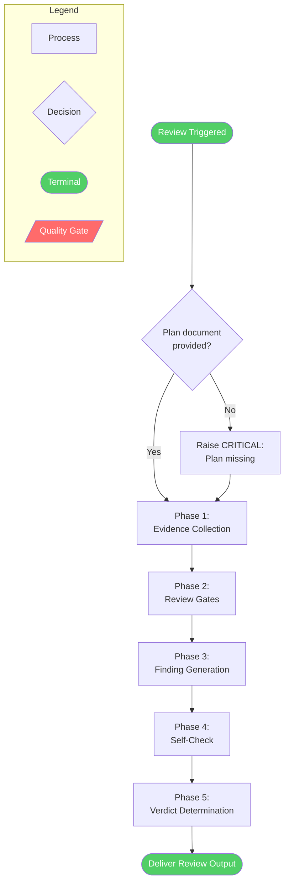
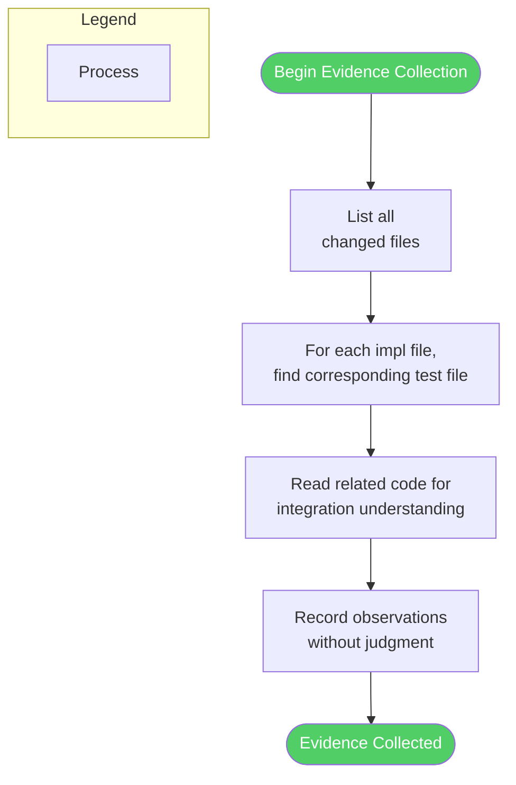
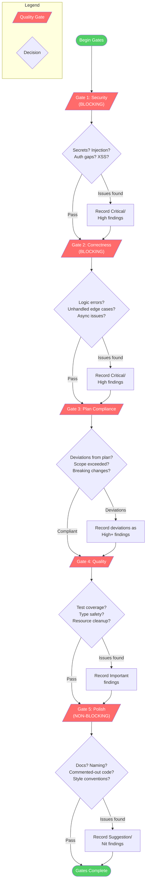
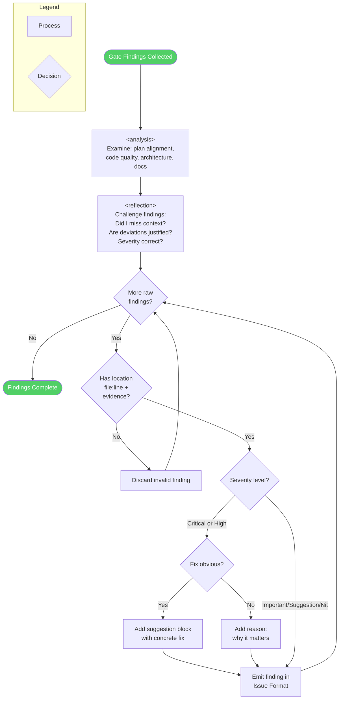
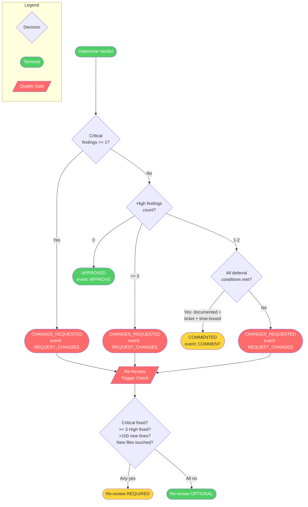

<!-- diagram-meta: {"source": "agents/code-reviewer.md","source_hash": "sha256:6594b233686e60675a70d572bbdfa6155c156d370e8cc3950d41aa821e158ca2","generated_at": "2026-03-19T00:00:00Z","generator": "generating-diagrams skill"} -->
# Diagram: code-reviewer

Senior code review agent that validates implementations against plans and coding standards. Uses ordered review gates, evidence-based findings, and a decision matrix for verdicts.

## Overview Diagram

```mermaid
flowchart TD
    subgraph Legend
        L1[Process]
        L2{Decision}
        L3([Terminal])
        L4[/"Quality Gate"/]
        style L4 fill:#ff6b6b,color:#fff
        style L3 fill:#51cf66,color:#fff
    end

    Start([Review Triggered]) --> InputCheck{Plan document<br>provided?}
    InputCheck -->|No| CriticalFinding[Raise CRITICAL:<br>Plan missing]
    InputCheck -->|Yes| Evidence[Phase 1:<br>Evidence Collection]
    CriticalFinding --> Evidence

    Evidence --> Gates[Phase 2:<br>Review Gates]
    Gates --> Findings[Phase 3:<br>Finding Generation]
    Findings --> SelfCheck[Phase 4:<br>Self-Check]
    SelfCheck --> Verdict[Phase 5:<br>Verdict Determination]
    Verdict --> Output([Deliver Review Output])

    style Start fill:#51cf66,color:#fff
    style Output fill:#51cf66,color:#fff
```

### Cross-Reference: Overview to Detail Diagrams

| Overview Node | Detail Diagram |
|---------------|----------------|
| Phase 1: Evidence Collection | [Evidence Collection](#phase-1-evidence-collection) |
| Phase 2: Review Gates | [Review Gates](#phase-2-review-gates) |
| Phase 3: Finding Generation | [Finding Generation](#phase-3-finding-generation) |
| Phase 4: Self-Check | [Self-Check](#phase-4-self-check) |
| Phase 5: Verdict Determination | [Verdict Determination](#phase-5-verdict-determination) |

## Phase 1: Evidence Collection

Systematic collection before any judgments are made.

```mermaid
flowchart TD
    subgraph Legend
        L1[Process]
    end

    Start([Begin Evidence Collection]) --> ListFiles[List all<br>changed files]
    ListFiles --> FindTests[For each impl file,<br>find corresponding test file]
    FindTests --> GatherCtx[Read related code for<br>integration understanding]
    GatherCtx --> NoteObs[Record observations<br>without judgment]
    NoteObs --> Done([Evidence Collected])

    style Start fill:#51cf66,color:#fff
    style Done fill:#51cf66,color:#fff
```

## Phase 2: Review Gates

Gates are evaluated in order. Early gate failures may short-circuit later gates. Gates 1-2 are blocking; Gate 5 is non-blocking.

```mermaid
flowchart TD
    subgraph Legend
        L1[/"Quality Gate"/]
        L2{Decision}
        style L1 fill:#ff6b6b,color:#fff
    end

    Start([Begin Gates]) --> G1[/"Gate 1: Security<br>(BLOCKING)"/]
    G1 --> G1Check{Secrets? Injection?<br>Auth gaps? XSS?}
    G1Check -->|Issues found| G1Findings[Record Critical/<br>High findings]
    G1Check -->|Pass| G2

    G1Findings --> G2[/"Gate 2: Correctness<br>(BLOCKING)"/]
    G2 --> G2Check{Logic errors?<br>Unhandled edge cases?<br>Async issues?}
    G2Check -->|Issues found| G2Findings[Record Critical/<br>High findings]
    G2Check -->|Pass| G3

    G2Findings --> G3[/"Gate 3: Plan Compliance"/]
    G3 --> G3Check{Deviations from plan?<br>Scope exceeded?<br>Breaking changes?}
    G3Check -->|Deviations| G3Findings[Record deviations as<br>High+ findings]
    G3Check -->|Compliant| G4

    G3Findings --> G4[/"Gate 4: Quality"/]
    G4 --> G4Check{Test coverage?<br>Type safety?<br>Resource cleanup?}
    G4Check -->|Issues found| G4Findings[Record Important<br>findings]
    G4Check -->|Pass| G5

    G4Findings --> G5[/"Gate 5: Polish<br>(NON-BLOCKING)"/]
    G5 --> G5Check{Docs? Naming?<br>Commented-out code?<br>Style conventions?}
    G5Check -->|Issues found| G5Findings[Record Suggestion/<br>Nit findings]
    G5Check -->|Pass| Done([Gates Complete])
    G5Findings --> Done

    style Start fill:#51cf66,color:#fff
    style Done fill:#51cf66,color:#fff
    style G1 fill:#ff6b6b,color:#fff
    style G2 fill:#ff6b6b,color:#fff
    style G3 fill:#ff6b6b,color:#fff
    style G4 fill:#ff6b6b,color:#fff
    style G5 fill:#ff6b6b,color:#fff
```

## Phase 3: Finding Generation

Each finding passes through analysis, reflection, and format validation before inclusion. Findings without evidence are discarded.

```mermaid
flowchart TD
    subgraph Legend
        L1[Process]
        L2{Decision}
    end

    Start([Gate Findings Collected]) --> Analyze["&lt;analysis&gt;<br>Examine: plan alignment,<br>code quality, architecture, docs"]

    Analyze --> Reflect["&lt;reflection&gt;<br>Challenge findings:<br>Did I miss context?<br>Are deviations justified?<br>Severity correct?"]

    Reflect --> NextFinding{More raw<br>findings?}
    NextFinding -->|No| Done([Findings Complete])
    NextFinding -->|Yes| FormatCheck{Has location<br>file:line +<br>evidence?}

    FormatCheck -->|No| Discard[Discard invalid finding]
    FormatCheck -->|Yes| SeverityCheck{Severity level?}

    SeverityCheck -->|Critical or High| FixCheck{Fix obvious?}
    FixCheck -->|Yes| AddSuggestion[Add suggestion block<br>with concrete fix]
    FixCheck -->|No| AddReason[Add reason:<br>why it matters]
    AddSuggestion --> Emit[Emit finding in<br>Issue Format]
    AddReason --> Emit

    SeverityCheck -->|Important/Suggestion/Nit| Emit

    Discard --> NextFinding
    Emit --> NextFinding

    style Start fill:#51cf66,color:#fff
    style Done fill:#51cf66,color:#fff
```

## Phase 4: Self-Check

Three sequential quality gates validate findings before verdict determination.

```mermaid
flowchart TD
    subgraph Legend
        L1[/"Quality Gate"/]
        L2{Decision}
        style L1 fill:#ff6b6b,color:#fff
    end

    Start([Begin Self-Check]) --> QG[/"Findings Quality Gate"/]
    QG --> Q1{Every finding has<br>location file:line?}
    Q1 -->|No| Fix1[Fix or discard findings<br>without location]
    Q1 -->|Yes| Q2
    Fix1 --> Q2{Every finding has<br>evidence snippet?}
    Q2 -->|No| Fix2[Fix or discard findings<br>without evidence]
    Q2 -->|Yes| Q3
    Fix2 --> Q3{Critical/High have<br>reason + suggestion?}
    Q3 -->|No| Fix3[Add missing reasons<br>and suggestions]
    Q3 -->|Yes| APG
    Fix3 --> APG

    APG[/"Anti-Pattern Gate"/]
    APG --> AP1{Rubber-stamping?<br>Reviewed substantively?}
    AP1 -->|Rubber-stamp| Deepen[Review more<br>substantively]
    AP1 -->|OK| AP2
    Deepen --> AP2{Nitpicking blockers?<br>Style as Critical?}
    AP2 -->|Yes| Downgrade[Reclassify style<br>issues as Nit]
    AP2 -->|No| AP3
    Downgrade --> AP3{Drive-by findings?<br>Missing evidence?}
    AP3 -->|Yes| AddEvidence[Add evidence and<br>suggestions]
    AP3 -->|No| CG
    AddEvidence --> CG

    CG[/"Completeness Gate"/]
    CG --> C1{All files reviewed?<br>Tests assessed?<br>Plan checked?<br>Security gate passed?}
    C1 -->|No| BackFill[Review missed areas]
    C1 -->|Yes| Done([Self-Check Passed])
    BackFill --> Done

    style Start fill:#51cf66,color:#fff
    style Done fill:#51cf66,color:#fff
    style QG fill:#ff6b6b,color:#fff
    style APG fill:#ff6b6b,color:#fff
    style CG fill:#ff6b6b,color:#fff
```

## Phase 5: Verdict Determination

Decision matrix maps finding counts to verdicts. Blocked verdicts trigger re-review assessment.

```mermaid
flowchart TD
    subgraph Legend
        L1{Decision}
        L2([Terminal])
        L3[/"Quality Gate"/]
        style L3 fill:#ff6b6b,color:#fff
        style L2 fill:#51cf66,color:#fff
    end

    Start([Determine Verdict]) --> CritCheck{Critical<br>findings >= 1?}
    CritCheck -->|Yes| Blocked1([CHANGES_REQUESTED<br>event: REQUEST_CHANGES])
    CritCheck -->|No| HighCount{High findings<br>count?}

    HighCount -->|">= 3"| Blocked2([CHANGES_REQUESTED<br>event: REQUEST_CHANGES])
    HighCount -->|1-2| DeferCheck{All deferral<br>conditions met?}
    HighCount -->|0| Approved([APPROVED<br>event: APPROVE])

    DeferCheck -->|"Yes: documented +<br>ticket + time-boxed"| Commented([COMMENTED<br>event: COMMENT])
    DeferCheck -->|No| Blocked3([CHANGES_REQUESTED<br>event: REQUEST_CHANGES])

    Blocked1 --> ReReview[/"Re-Review<br>Trigger Check"/]
    Blocked2 --> ReReview
    Blocked3 --> ReReview

    ReReview --> RR1{Critical fixed?<br>>= 3 High fixed?<br>>100 new lines?<br>New files touched?}
    RR1 -->|Any yes| Required([Re-review REQUIRED])
    RR1 -->|All no| Optional([Re-review OPTIONAL])

    style Start fill:#51cf66,color:#fff
    style Blocked1 fill:#ff6b6b,color:#fff
    style Blocked2 fill:#ff6b6b,color:#fff
    style Blocked3 fill:#ff6b6b,color:#fff
    style Commented fill:#ffd43b,color:#333
    style Approved fill:#51cf66,color:#fff
    style Required fill:#ffd43b,color:#333
    style Optional fill:#51cf66,color:#fff
    style ReReview fill:#ff6b6b,color:#fff
```

## Source Cross-Reference

| Diagram Node | Source Line(s) | Description |
|-------------|----------------|-------------|
| Plan document provided? | 26 | Plan is required input |
| Raise CRITICAL: Plan missing | 262 | Forbidden: proceeding without plan |
| List changed files | 163 | Evidence Collection step 1 |
| Find corresponding test file | 164 | Evidence Collection step 2 |
| Read related code | 165 | Evidence Collection step 3 |
| Record observations | 166 | Evidence Collection step 4 |
| Gate 1: Security | 191-196 | Security gate checklist |
| Gate 2: Correctness | 198-204 | Correctness gate checklist |
| Gate 3: Plan Compliance | 206-210 | Plan compliance checklist |
| Gate 4: Quality | 212-216 | Quality gate checklist |
| Gate 5: Polish | 218-222 | Polish gate checklist (non-blocking) |
| Analysis phase | 41-44 | Examination schema |
| Reflection phase | 46-49 | Challenge initial findings |
| Finding format validation | 178-185 | Evidence requirements rule |
| Suggestion block | 66-80 | GitHub suggestion format |
| Findings Quality Gate | 226-230 | Self-check: findings quality |
| Anti-Pattern Gate | 233-239 | Self-check: anti-pattern detection |
| Completeness Gate | 242-246 | Self-check: completeness verification |
| Decision Matrix | 127-132 | Verdict determination table |
| Deferral conditions | 138-141 | Justified deferral criteria |
| Re-Review triggers | 147-154 | Required vs optional re-review |
| Anti-patterns to flag | 107-111 | Green Mirage, silent swallowing, plan drift, type erosion |

## Output Structure

The final review delivers five sections:

1. **Summary** - Scope, verdict, blocking issue count (2-3 sentences)
2. **What Works** - Specific acknowledgment of quality work
3. **Issues** - Grouped by severity: Critical > High > Important > Suggestion > Nit
4. **Plan Deviation Report** - Justified vs unjustified deviations
5. **Recommended Next Actions** - Concrete steps
