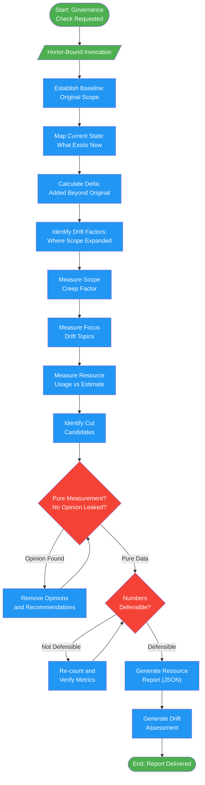

<!-- diagram-meta: {"source": "agents/emperor-governor.md", "source_hash": "sha256:de41ed5a63ac99d5528062e8df983257e4e4d9b21e8ee1615a4cacf4cc7cd9b5", "generated_at": "2026-02-19T00:00:00Z", "generator": "generate_diagrams.py"} -->
# Diagram: emperor-governor

Resource governance agent that tracks scope creep, token usage, and project drift. Reports pure measurements without opinions or recommendations.

## Legend

| Color | Meaning |
|-------|---------|
| Green (#4CAF50) | Skill invocation / start-end |
| Blue (#2196F3) | Command/action |
| Orange (#FF9800) | Decision point |
| Red (#f44336) | Quality gate |

## Cross-Reference

| Node | Source Reference |
|------|----------------|
| Honor-Bound Invocation | Lines 14-15: Honor pledge before measurement |
| Establish Baseline | Lines 53: Analysis step 1 - original scope |
| Map Current State | Lines 54: Analysis step 2 - what exists now |
| Calculate Delta | Lines 55: Analysis step 3 - added beyond original |
| Identify Drift Factors | Lines 56: Analysis step 4 - where scope expanded |
| Measure Scope Creep Factor | Lines 61: current_items / original_items |
| Measure Focus Drift Topics | Lines 62: Tangential topics count |
| Measure Resource Usage | Lines 63: Tokens/time spent vs estimated |
| Identify Cut Candidates | Lines 90-96: Items not in original scope |
| Pure Measurement? | Lines 74-75: Reflection - is this pure measurement? |
| Numbers Defensible? | Lines 76: Would another observer reach same counts? |
| Generate Resource Report | Lines 81-103: JSON resource report format |
| Generate Drift Assessment | Lines 107-131: Drift assessment markdown format |
