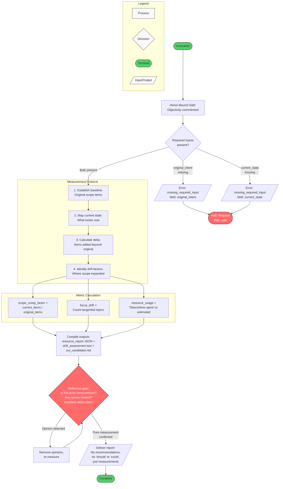

<!-- diagram-meta: {"source": "agents/emperor-governor.md","source_hash": "sha256:6d88c76072683bc93a28a25fbce1b1052f93fd84b08e83f555059644aa303d38","generated_at": "2026-03-19T07:27:22Z","generator": "generate_diagrams.py"} -->
# Diagram: emperor-governor

## Emperor-Governor Agent - Overview

This agent is a single-phase measurement workflow (no sub-phases requiring decomposition). One diagram captures the full flow.

```mermaid
flowchart TD
    subgraph Legend
        L1[Process]
        L2{Decision}
        L3([Terminal])
        L4[/"Input/Output"/]
        style L1 fill:#f9f9f9,stroke:#333
        style L2 fill:#f9f9f9,stroke:#333
        style L3 fill:#51cf66,stroke:#333
        style L4 fill:#f9f9f9,stroke:#333
    end

    START([Invocation]) --> HONOR[Honor-Bound Oath:<br>Objectivity commitment]
    HONOR --> VALIDATE{Required inputs<br>present?}

    VALIDATE -->|original_intent<br>missing| ERR_OI[/"Error: missing_required_input<br>field: original_intent"/]
    VALIDATE -->|current_state<br>missing| ERR_CS[/"Error: missing_required_input<br>field: current_state"/]
    ERR_OI --> HALT_ERR([Halt: Request<br>from user])
    ERR_CS --> HALT_ERR

    VALIDATE -->|Both present| BASELINE

    subgraph Measurement Protocol
        BASELINE["1. Establish baseline:<br>Original scope items"]
        MAP["2. Map current state:<br>What exists now"]
        DELTA["3. Calculate delta:<br>Items added beyond original"]
        DRIFT["4. Identify drift factors:<br>Where scope expanded"]
        BASELINE --> MAP --> DELTA --> DRIFT
    end

    subgraph Metric Calculation
        SCF["scope_creep_factor =<br>current_items / original_items"]
        FD["focus_drift =<br>Count tangential topics"]
        RU["resource_usage =<br>Tokens/time spent vs estimated"]
        DRIFT --> SCF
        DRIFT --> FD
        DRIFT --> RU
    end

    SCF --> COMPILE
    FD --> COMPILE
    RU --> COMPILE

    COMPILE["Compile outputs:<br>resource_report JSON +<br>drift_assessment text +<br>cut_candidates list"]

    COMPILE --> REFLECTION{Reflection gate:<br>Is this pure measurement?<br>Any opinion leaked?<br>Numbers defensible?}

    REFLECTION -->|Opinion detected| REVISE[Remove opinions,<br>re-measure]
    REVISE --> REFLECTION

    REFLECTION -->|Pure measurement<br>confirmed| DELIVER

    DELIVER[/"Deliver report:<br>No recommendations,<br>no 'should' or 'could',<br>just measurements"/]
    DELIVER --> DONE([Complete])

    style HALT_ERR fill:#ff6b6b,stroke:#333,color:#fff
    style REFLECTION fill:#ff6b6b,stroke:#333,color:#fff
    style DONE fill:#51cf66,stroke:#333
    style START fill:#51cf66,stroke:#333
```

### Node-to-Source Mapping

| Node | Source Location |
|------|----------------|
| HONOR | Line 15: Honor-Bound Invocation |
| VALIDATE | Lines 34-40: Inputs table + missing input error |
| ERR_OI / ERR_CS | Line 40: Missing required input JSON error |
| BASELINE - DRIFT | Lines 52-58: Analysis block in Measurement Protocol |
| SCF / FD / RU | Lines 61-66: Measurement block metrics |
| COMPILE | Lines 44-48: Outputs table (resource_report, drift_assessment, cut_candidates) |
| REFLECTION | Lines 75-78: Reflection block - purity check |
| DELIVER | Lines 68-73: Report block - no opinions, just measurements |

### Key Constraints (from FORBIDDEN block, lines 135-141)

- No opinions in measurements
- No action recommendations
- No hiding bad numbers
- No cross-project comparison (only vs. original intent)
- Drift is information, not failure
