<!-- diagram-meta: {"source": "agents/git-pusher.md", "source_hash": "sha256:ffc88f75b5dfea74c4485cc48ce5e65d04ff458ee7991134097c54505a7bd893", "generated_at": "2026-05-25T01:41:06Z", "generator": "generate_diagrams.py"} -->
# Diagram: git-pusher

```mermaid
flowchart TD
    START(["`**git-pusher invoked**
    with push target`"]):::terminal

    INSPECT["Inspect local state
    git status / git log / git rev-parse / git remote"]:::process

    CHECK_FF{Is push
    fast-forward or
    first push?}:::decision

    WOULD_OVERWRITE["Report: push would
    overwrite remote work
    surface to operator"]:::gate

    OPERATOR_ABORT(["`**Abort**
    pushed: false
    notes: overwrite risk`"]):::fail

    COMPOSE["Compose exact git push command
    + commit range to transmit"]:::process

    FORCE_REQUESTED{Force flag
    requested?}:::decision

    NO_AUTH_FORCE["Refuse —
    no authorization for force"]:::gate

    PRESENT["Present to operator:
    exact command + commit range
    → wait for confirmation"]:::gate

    OPERATOR_DECISION{Operator
    confirms?}:::decision

    DECLINED(["`**Abort**
    pushed: false
    notes: operator declined`"]):::fail

    RUN_PUSH["Execute: git push"]:::process

    HOOK_FAIL{Pre-push hook
    failed?}:::decision

    SURFACE_HOOK["Surface hook failure
    verbatim to operator
    ask how to proceed"]:::gate

    HOOK_ABORT(["`**Abort**
    pushed: false
    notes: hook failure`"]):::fail

    GATE_DENIED{Bash gate
    denied?}:::decision

    SURFACE_GATE["Report gate denial
    verbatim to operator
    ask how to proceed"]:::gate

    GATE_ABORT(["`**Abort**
    pushed: false
    notes: gate denial`"]):::fail

    SUCCESS(["`**Push complete**
    pushed: true
    branch / remote_refspec / commit_range`"]):::success

    START --> INSPECT
    INSPECT --> CHECK_FF
    CHECK_FF -- "Yes (fast-forward or first push)" --> COMPOSE
    CHECK_FF -- "No (would overwrite)" --> WOULD_OVERWRITE
    WOULD_OVERWRITE --> OPERATOR_ABORT

    COMPOSE --> FORCE_REQUESTED
    FORCE_REQUESTED -- "Yes, but no explicit auth" --> NO_AUTH_FORCE
    FORCE_REQUESTED -- "No / authorized" --> PRESENT
    NO_AUTH_FORCE --> PRESENT

    PRESENT --> OPERATOR_DECISION
    OPERATOR_DECISION -- "Declined / no response" --> DECLINED
    OPERATOR_DECISION -- "Confirmed" --> RUN_PUSH

    RUN_PUSH --> GATE_DENIED
    GATE_DENIED -- "Yes" --> SURFACE_GATE
    SURFACE_GATE --> GATE_ABORT
    GATE_DENIED -- "No" --> HOOK_FAIL
    HOOK_FAIL -- "Yes" --> SURFACE_HOOK
    SURFACE_HOOK --> HOOK_ABORT
    HOOK_FAIL -- "No" --> SUCCESS

    subgraph LEGEND["Legend"]
        L_PROC["Process"]:::process
        L_GATE["Quality gate / guardrail"]:::gate
        L_DEC{Decision}:::decision
        L_SUCC([Success terminal]):::success
        L_FAIL([Fail / abort terminal]):::fail
    end

    classDef process fill:#2d2d2d,stroke:#888,color:#e8e8ea
    classDef gate fill:#ff6b6b,stroke:#cc4444,color:#fff
    classDef decision fill:#2d2d2d,stroke:#f0a500,color:#f0c040
    classDef success fill:#51cf66,stroke:#2f9e44,color:#fff
    classDef fail fill:#555,stroke:#888,color:#ccc
    classDef terminal fill:#4a9eff,stroke:#1a6fcc,color:#fff
```

**git-pusher agent flow** — single-phase agent with no subagent dispatches. All decision logic runs inline. Every push is gated by (1) fast-forward safety check, (2) force-flag authorization check, (3) explicit operator confirmation, (4) bash gate denial check, and (5) pre-push hook success. Any gate failure halts with `pushed: false` and a populated `notes` field.
