<!-- diagram-meta: {"source": "agents/hierophant-distiller.md", "source_hash": "sha256:0926664a8def3028b00d74558489ec97b42df668df847e6e8e9e0841b6e824b0", "generated_at": "2026-02-19T00:00:00Z", "generator": "generate_diagrams.py"} -->
# Diagram: hierophant-distiller

Wisdom extraction agent that distills enduring lessons from completed projects. Finds the single most profound insight and transforms ephemeral history into permanent doctrine.

```mermaid
flowchart TD
    Start([Start: Project\nComplete])
    Invoke[/Honor-Bound Invocation/]

    ReadStory["Read Entire Story:\nStart to Finish"]
    IdentifyGoal["Identify Initial Goal"]
    IdentifyObstacles["Identify Obstacles\nEncountered"]
    FindTurning["Find Turning Points"]
    NoteFinalOutcome["Note Final Outcome"]

    SearchRecurring["Search Recurring\nThemes"]
    WhatWorked["What Worked\nConsistently?"]
    WhatFailed["What Failed\nConsistently?"]
    WhatSurprised["What Surprised\nEveryone?"]

    DistillOne["Distill: ONE\nKey Lesson"]
    PreventQuestion{"Would This Prevent\nHardest Problems?"}
    RefineLesson["Refine to\nNon-Obvious Truth"]

    SpecificGate{"Specific Enough\nto Act On?"}
    MakeSpecific["Add Concrete\nGuidance"]

    EssenceGate{"Captures Essence,\nNot Surface?"}
    DeepDig["Dig Deeper Into\nRoot Pattern"]

    ContextFreeGate{"Understandable\nWithout Context?"}
    Simplify["Simplify for\nExternal Reader"]

    MemorableGate{"Is It\nMemorable?"}
    Sharpen["Sharpen the\nPhrasing"]

    GenDoctrine["Generate Doctrine\nEntry"]
    GenTurningPoint["Generate Turning\nPoint Narrative"]
    GenEncyclopedia["Generate Encyclopedia\nEntry"]

    Done([End: Wisdom\nPreserved])

    Start --> Invoke
    Invoke --> ReadStory
    ReadStory --> IdentifyGoal
    IdentifyGoal --> IdentifyObstacles
    IdentifyObstacles --> FindTurning
    FindTurning --> NoteFinalOutcome

    NoteFinalOutcome --> SearchRecurring
    SearchRecurring --> WhatWorked
    WhatWorked --> WhatFailed
    WhatFailed --> WhatSurprised

    WhatSurprised --> DistillOne
    DistillOne --> PreventQuestion
    PreventQuestion -->|No| RefineLesson
    RefineLesson --> DistillOne
    PreventQuestion -->|Yes| SpecificGate

    SpecificGate -->|No| MakeSpecific
    MakeSpecific --> SpecificGate
    SpecificGate -->|Yes| EssenceGate

    EssenceGate -->|No| DeepDig
    DeepDig --> EssenceGate
    EssenceGate -->|Yes| ContextFreeGate

    ContextFreeGate -->|No| Simplify
    Simplify --> ContextFreeGate
    ContextFreeGate -->|Yes| MemorableGate

    MemorableGate -->|No| Sharpen
    Sharpen --> MemorableGate
    MemorableGate -->|Yes| GenDoctrine

    GenDoctrine --> GenTurningPoint
    GenTurningPoint --> GenEncyclopedia
    GenEncyclopedia --> Done

    style Start fill:#4CAF50,color:#fff
    style Done fill:#4CAF50,color:#fff
    style Invoke fill:#4CAF50,color:#fff
    style ReadStory fill:#2196F3,color:#fff
    style IdentifyGoal fill:#2196F3,color:#fff
    style IdentifyObstacles fill:#2196F3,color:#fff
    style FindTurning fill:#2196F3,color:#fff
    style NoteFinalOutcome fill:#2196F3,color:#fff
    style SearchRecurring fill:#2196F3,color:#fff
    style WhatWorked fill:#2196F3,color:#fff
    style WhatFailed fill:#2196F3,color:#fff
    style WhatSurprised fill:#2196F3,color:#fff
    style DistillOne fill:#2196F3,color:#fff
    style RefineLesson fill:#2196F3,color:#fff
    style MakeSpecific fill:#2196F3,color:#fff
    style DeepDig fill:#2196F3,color:#fff
    style Simplify fill:#2196F3,color:#fff
    style Sharpen fill:#2196F3,color:#fff
    style GenDoctrine fill:#2196F3,color:#fff
    style GenTurningPoint fill:#2196F3,color:#fff
    style GenEncyclopedia fill:#2196F3,color:#fff
    style PreventQuestion fill:#FF9800,color:#fff
    style SpecificGate fill:#f44336,color:#fff
    style EssenceGate fill:#f44336,color:#fff
    style ContextFreeGate fill:#f44336,color:#fff
    style MemorableGate fill:#f44336,color:#fff
```

## Legend

| Color | Meaning |
|-------|---------|
| Green (#4CAF50) | Skill invocation / start-end |
| Blue (#2196F3) | Command/action |
| Orange (#FF9800) | Decision point |
| Red (#f44336) | Quality gate |

## Cross-Reference

| Node | Source Reference |
|------|----------------|
| Honor-Bound Invocation | Lines 14-15: Honor pledge before distillation |
| Read Entire Story | Lines 54: Analysis - read start to finish |
| Identify Initial Goal | Lines 55: Analysis step 1 |
| Identify Obstacles | Lines 56: Analysis step 2 |
| Find Turning Points | Lines 57: Analysis step 3 |
| Note Final Outcome | Lines 58: Analysis step 4 |
| Search Recurring Themes | Lines 62: Pattern search phase |
| What Worked Consistently? | Lines 64: Pattern search question |
| What Failed Consistently? | Lines 65: Pattern search question |
| What Surprised Everyone? | Lines 66: Pattern search question |
| Distill: ONE Key Lesson | Lines 70-71: Distillation - one thing to tell future devs |
| Would This Prevent Hardest Problems? | Lines 72: Distillation question |
| Specific Enough to Act On? | Lines 78: Reflection check 1 |
| Captures Essence, Not Surface? | Lines 79: Reflection check 2 |
| Understandable Without Context? | Lines 80: Reflection check 3 |
| Is It Memorable? | Lines 81: Reflection check 4 |
| Generate Doctrine Entry | Lines 87-109: Doctrine format output |
| Generate Turning Point Narrative | Lines 94-98: Turning point section |
| Generate Encyclopedia Entry | Lines 113-123: Encyclopedia entry format |
