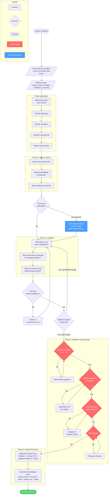

<!-- diagram-meta: {"source": "agents/hierophant-distiller.md","source_hash": "sha256:b2b0aed444030f7a0c9d2336aa841dbd85dcb0efe4f60b17b969b5e1e0451094","generator": "stamp"} -->
# Diagram: hierophant-distiller

Wisdom extraction agent that distills enduring lessons from completed projects. Finds the single most profound insight and transforms ephemeral history into permanent doctrine.

```mermaid
flowchart TD
    subgraph Legend
        direction LR
        L1[Process]
        L2{Decision}
        L3([Terminal])
        L4[Quality Gate]:::gate
        L5[Subagent Dispatch]:::subagent
    end

    Start([Project Complete]) --> Honor[/"Honor-Bound Invocation:<br>Commit to finding ONE lesson"/]
    Honor --> Ingest[/"Receive Inputs:<br>project_history, critiques,<br>resolutions, outcomes"/]

    Ingest --> A1

    subgraph Analysis ["Phase 1: Analysis"]
        A1["Read entire story<br>start to finish"]
        A2["Identify initial goal"]
        A3["Identify obstacles"]
        A4["Identify turning points"]
        A5["Identify final outcome"]
        A1 --> A2 --> A3 --> A4 --> A5
    end

    A5 --> P1

    subgraph PatternSearch ["Phase 2: Pattern Search"]
        P1["Search recurring themes"]
        P2["What worked/failed<br>consistently?"]
        P3["What surprised everyone?"]
        P1 --> P2 --> P3
    end

    P3 --> FractalDecision{Use fractal<br>exploration?}
    FractalDecision -- "Yes (optional)" --> Fractal["Invoke fractal-thinking<br>intensity: pulse<br>seed: deepest lesson"]:::subagent
    FractalDecision -- "No" --> D1
    Fractal --> D1

    subgraph Distillation ["Phase 3: Distillation"]
        D1["ONE thing to tell<br>future developers?"]
        D2["What would have prevented<br>the hardest problems?"]
        D3["What non-obvious truth<br>did this project reveal?"]
        D1 --> D2 --> D3
    end

    D3 --> PreventGate{Prevents<br>hardest problems?}
    PreventGate -- "No" --> RefineLesson["Refine to<br>non-obvious truth"]
    RefineLesson --> D1
    PreventGate -- "Yes" --> MultiCheck{Multiple insights<br>remaining?}
    MultiCheck -- "Yes: not distilled enough" --> D1
    MultiCheck -- "No: single insight" --> R1

    subgraph Reflection ["Phase 4: Reflection Quality Gates"]
        R1{"Specific enough<br>to act on?"}:::gate
        MakeSpecific["Add concrete guidance"]
        R1 -- "No" --> MakeSpecific --> R1

        R2{"Captures essence,<br>not surface?"}:::gate
        DeepDig["Dig deeper into<br>root pattern"]
        R1 -- "Yes" --> R2
        R2 -- "No" --> DeepDig --> R2

        R3{"Understandable<br>without context?"}:::gate
        Simplify["Simplify for<br>external reader"]
        R2 -- "Yes" --> R3
        R3 -- "No" --> Simplify --> R3

        R4{"Memorable?"}:::gate
        Sharpen["Sharpen phrasing"]
        R3 -- "Yes" --> R4
        R4 -- "No" --> Sharpen --> R4
    end

    R4 -- "Yes" --> O1

    subgraph Output ["Phase 5: Output Generation"]
        O1["Generate Doctrine entry:<br>Wisdom + Turning Point +<br>Applied Guidance + Origin"]
        O2["Generate Encyclopedia entry:<br>Pattern Name + Doctrine +<br>When + What to do + Origin"]
        O1 --> O2
    end

    O2 --> Done([Wisdom Preserved]):::success

    classDef gate fill:#ff6b6b,stroke:#c92a2a,color:#fff
    classDef subagent fill:#4a9eff,stroke:#1971c2,color:#fff
    classDef success fill:#51cf66,stroke:#2b8a3e,color:#fff
```

## Legend

| Color | Meaning |
|-------|---------|
| Blue (`#4a9eff`) | Subagent dispatch |
| Red (`#ff6b6b`) | Quality gate |
| Green (`#51cf66`) | Success terminal |
| Default | Process / action |

## Cross-Reference

| Node | Source Reference |
|------|-----------------|
| Honor-Bound Invocation | Lines 14-15: pledge before distillation |
| Receive Inputs | Lines 33-38: project_history, critiques, resolutions, outcomes |
| Phase 1: Analysis | Lines 55-61: 4-question story read |
| Phase 2: Pattern Search | Lines 63-68: recurring themes, worked/failed, surprises |
| Fractal exploration | Line 70: optional fractal-thinking, intensity pulse |
| Phase 3: Distillation | Lines 72-76: three distillation questions |
| Prevents hardest problems? | Line 74: key distillation filter |
| Multiple insights remaining? | Lines 50-51, 131: ONE key lesson invariant |
| Phase 4: Reflection gates | Lines 78-83: specific, essential, context-free, memorable |
| Doctrine output | Lines 90-112: Doctrine format |
| Encyclopedia output | Lines 116-126: Encyclopedia entry format |
