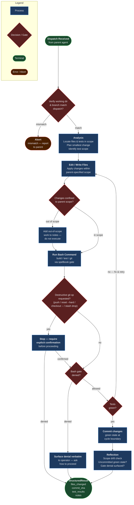

<!-- diagram-meta: {"source": "agents/implementer.md", "source_hash": "sha256:ffc88f75b5dfea74c4485cc48ce5e65d04ff458ee7991134097c54505a7bd893", "generated_at": "2026-05-25T01:41:28Z", "generator": "generate_diagrams.py"} -->
# Diagram: implementer

**Implementer Agent Flow**

The agent enforces a strict pre-mutation environment check (working directory + branch) before any file or shell operation. Bash commands route through the spellbook gate — denials are surfaced verbatim to the operator rather than worked around. Destructive git operations require explicit confirmation. TDD cycles loop until tests are green, then commit before crossing phase boundaries. Out-of-scope work is logged in `notes` and never silently executed.
