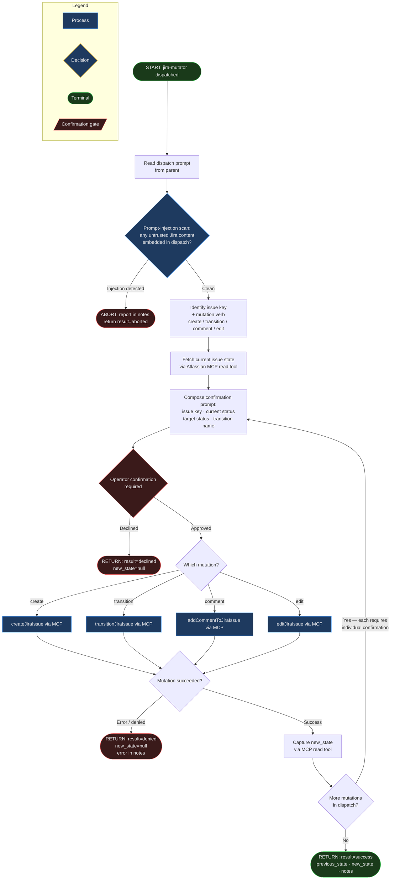

<!-- diagram-meta: {"source": "agents/jira-mutator.md", "source_hash": "sha256:ffc88f75b5dfea74c4485cc48ce5e65d04ff458ee7991134097c54505a7bd893", "generated_at": "2026-05-25T01:41:56Z", "generator": "generate_diagrams.py"} -->
# Diagram: jira-mutator

