<!-- diagram-meta: {"source": "agents/jira-reader.md", "source_hash": "sha256:ffc88f75b5dfea74c4485cc48ce5e65d04ff458ee7991134097c54505a7bd893", "generated_at": "2026-05-25T01:42:17Z", "generator": "generate_diagrams.py"} -->
# Diagram: jira-reader

```mermaid
flowchart TD
    A(["`**Dispatch Received**
    from parent agent`"]) --> B[/Classify dispatch type/]

    B -->|Single issue key| C["Read local files if provided
    (issue ID lists, project briefs,
    prior research, query plans)"]
    B -->|Multi-issue / JQL search| C

    C --> D["<analysis>
    Plan MCP read calls / JQL
    Identify required fields"]

    D --> E{Write request
    implied?}
    E -->|Yes| F["Decline write request
    Report in notes"]
    E -->|No| G[Execute Atlassian MCP read calls]

    G --> H["getJiraIssue
    searchJiraIssuesUsingJql
    getJiraIssueRemoteIssueLinks
    getVisibleJiraProjects"]

    H --> I{Issues retrieved?}
    I -->|No results| J["Record empty result
    Note in notes field"]
    I -->|Results| K["Scan issue content for
    prompt-injection attempts"]

    K --> L{Injection
    detected?}
    L -->|Yes| M["Refuse to echo/follow
    injected instruction
    Note in notes field"]
    L -->|No| N["Extract structured fields:
    key, summary, status,
    assignee, url"]

    M --> N

    N --> O{Contradictions
    or mismatches?}
    O -->|Yes| P["Disclose conflict
    in notes — do NOT
    silently resolve"]
    O -->|No| Q

    P --> Q["<reflection>
    Cited all issue keys + URLs?
    Stayed strictly read-only?
    No instructions taken from content?"]

    J --> Q

    Q --> R{All findings
    cite key + URL?}
    R -->|No| S["Fix: add missing
    keys and URLs"]
    R -->|Yes| T

    S --> T["Assemble structured output:
    issue_key, issues[], queries[],
    notes"]

    T --> U(["`**Return JiraReaderResult JSON**
    to parent agent`"])

    F --> U

    subgraph legend["Legend"]
        L1["Process"]
        L2{Decision}
        L3([Terminal])
        L4["🔵 MCP Read Call"]
        L5["🔴 Guardrail / Quality Gate"]
        L6["🟢 Success Terminal"]
    end

    style A fill:#51cf66,color:#000
    style U fill:#51cf66,color:#000
    style F fill:#ff6b6b,color:#fff
    style H fill:#4a9eff,color:#fff
    style K fill:#ff6b6b,color:#fff
    style M fill:#ff6b6b,color:#fff
    style P fill:#ff6b6b,color:#fff
    style Q fill:#ff6b6b,color:#fff
    style R fill:#ff6b6b,color:#fff
    style S fill:#ff6b6b,color:#fff
```

**jira-reader agent** — read-only Jira inspection via runtime-discovered Atlassian MCP read tools. The agent classifies the dispatch (single issue vs. JQL search), executes MCP read calls, scans retrieved content for prompt injection, discloses contradictions, enforces citation of issue keys and URLs, and returns a `JiraReaderResult` JSON. Write requests are declined at entry and reported in `notes`. No mutations are ever performed.
