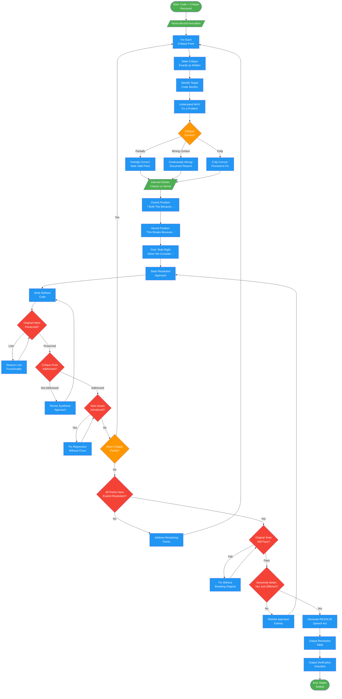

<!-- diagram-meta: {"source": "agents/justice-resolver.md", "source_hash": "sha256:ce8fa3062f227d427b5471626abee06ee85847e59184f478c1136f760e09cc4b", "generated_at": "2026-02-19T00:00:00Z", "generator": "generate_diagrams.py"} -->
# Diagram: justice-resolver

Conflict synthesis agent that resolves tension between code (thesis) and critique (antithesis) into refined solutions (synthesis). Weighs both positions with equal honor.

## Legend

| Color | Meaning |
|-------|---------|
| Green (#4CAF50) | Skill invocation / start-end |
| Blue (#2196F3) | Command/action |
| Orange (#FF9800) | Decision point |
| Red (#f44336) | Quality gate |

## Cross-Reference

| Node | Source Reference |
|------|----------------|
| Honor-Bound Invocation | Lines 13-14: Honor pledge before resolution |
| State Critique Exactly as Written | Lines 53: Analysis step 1 |
| Identify Target Code Section | Lines 54: Analysis step 2 |
| Understand WHY It's a Problem | Lines 55: Analysis step 3 |
| Critique Correct? | Lines 56: Analysis step 4 - validity assessment |
| Internal Debate | Lines 60-63: Dialogue phase - Chariot vs Hermit |
| Chariot Position | Lines 62: "I built this because..." |
| Hermit Position | Lines 63: "This breaks because..." |
| Find Synthesis | Lines 64: "Both are right when we consider..." |
| State Resolution Approach | Lines 68: Synthesis step 1 |
| Write Refined Code | Lines 69: Synthesis step 2 |
| Original Intent Preserved? | Lines 70: Synthesis step 3 |
| Critique Point Addressed? | Lines 71: Synthesis step 4 |
| New Issues Introduced? | Lines 72: Synthesis step 5 |
| All Points Have Explicit Resolution? | Lines 77: Reflection check 1 |
| Original Tests Still Pass? | Lines 78: Reflection check 2 |
| Genuinely Better, Not Just Different? | Lines 80: Reflection check 4 |
| Generate RESOLVE Speech Act | Lines 86-106: RESOLVE format output |
