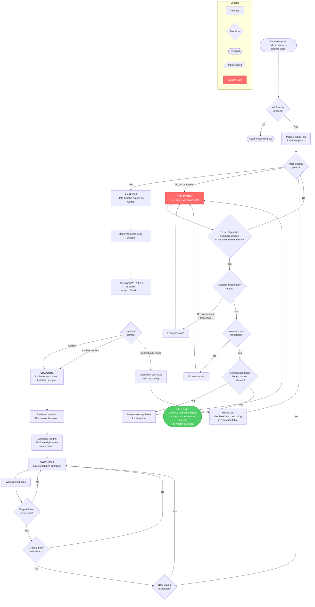

<!-- diagram-meta: {"source": "agents/justice-resolver.md","source_hash": "sha256:f4171eb178450e86ae107a11ece800c96c9a11b4e043434d92b8d7c11999f5ef","generated_at": "2026-03-19T07:29:36Z","generator": "generate_diagrams.py"} -->
# Diagram: justice-resolver

# Justice Resolver Agent - Workflow Diagram

## Overview

The Justice Resolver follows a linear four-phase protocol (Analysis, Dialogue, Synthesis, Reflection) with a per-critique-point loop and a quality gate before the terminal RESOLVE declaration.

```mermaid
flowchart TD
    subgraph Legend
        L1[Process]
        L2{Decision}
        L3([Terminal])
        L4[/Input-Output/]
        L5[Quality Gate]:::gate
    end

    Start([Receive Inputs:<br>code + critique + original_spec]) --> Validate{All 3 inputs<br>present?}
    Validate -->|No| Abort([Abort: Missing inputs])
    Validate -->|Yes| Parse[Parse critique into<br>individual points]

    Parse --> LoopStart{More critique<br>points?}

    %% === ANALYSIS PHASE ===
    LoopStart -->|Yes| A1["<b>ANALYSIS</b><br>State critique exactly as written"]
    A1 --> A2[Identify targeted code section]
    A2 --> A3[Understand WHY it is a problem<br>not just THAT it is]
    A3 --> A4{Is critique<br>correct?}
    A4 -->|Correct| D1
    A4 -->|Partially correct| D1
    A4 -->|Contextually wrong| Dismiss[Document dismissal<br>with reasoning]
    Dismiss --> Record[Record as<br>dismissed with reasoning<br>in resolution table]
    Record --> LoopStart

    %% === DIALOGUE PHASE ===
    D1["<b>DIALOGUE</b><br>Implementer position:<br>I built this because..."]
    D1 --> D2["Reviewer position:<br>This breaks because..."]
    D2 --> D3["Synthesis insight:<br>Both are right when<br>we consider..."]

    %% === SYNTHESIS PHASE ===
    D3 --> S1["<b>SYNTHESIS</b><br>State resolution approach"]
    S1 --> S2[Write refined code]
    S2 --> S3{Original intent<br>preserved?}
    S3 -->|No| S1
    S3 -->|Yes| S4{Critique point<br>addressed?}
    S4 -->|No| S1
    S4 -->|Yes| S5{New issues<br>introduced?}
    S5 -->|Yes| S1
    S5 -->|No| LoopStart

    %% === REFLECTION PHASE (Quality Gate) ===
    LoopStart -->|No, all processed| R1["<b>REFLECTION</b><br>Pre-RESOLVE quality gate"]:::gate
    R1 --> R2{Every critique has<br>explicit resolution<br>or documented dismissal?}
    R2 -->|No| LoopStart
    R2 -->|Yes| R3{Original functionality<br>intact?}
    R3 -->|No - run tests or<br>trace logic| FixReg[Fix regressions]
    FixReg --> R1
    R3 -->|Yes| R4{No new issues<br>introduced?}
    R4 -->|No| FixNew[Fix new issues]
    FixNew --> R1
    R4 -->|Yes| R5{Solution genuinely<br>better, not just<br>different?}
    R5 -->|No| Rethink[Re-examine synthesis<br>for elevation]
    Rethink --> R1
    R5 -->|Yes| Resolve

    %% === TERMINAL ===
    Resolve([RESOLVE:<br>Generate resolution report,<br>synthesis code, resolve speech<br>The matter is settled.]):::success

    classDef gate fill:#ff6b6b,stroke:#c0392b,color:#fff
    classDef success fill:#51cf66,stroke:#2f9e44,color:#fff
```

## Node-to-Source Mapping

| Node | Source Reference |
|------|-----------------|
| Start (Inputs) | Lines 29-36: Inputs table (code, critique, original_spec) |
| Parse | Lines 49-50: "For each critique point" |
| A1-A3 (Analysis) | Lines 48-55: `<analysis>` block, steps 1-3 |
| A4 (Correctness check) | Line 54: "Is the critique correct? Partially correct? Contextually wrong?" |
| Dismiss + Record | Line 55: "dismissed with reasoning in resolution table" |
| D1-D3 (Dialogue) | Lines 57-62: `<dialogue>` block, internal debate |
| S1-S5 (Synthesis) | Lines 64-71: `<synthesis>` block, steps 1-5 |
| R1-R5 (Reflection) | Lines 73-79: `<reflection>` block, pre-RESOLVE checks |
| Resolve | Lines 82-104: RESOLVE format with resolution table, summary, verification checklist |
| Anti-patterns | Lines 108-115: `<FORBIDDEN>` block (enforced as constraints throughout) |

## Key Design Observations

- **Per-point loop**: Each critique point goes through the full Analysis -> Dialogue -> Synthesis pipeline individually before the next point is processed.
- **Dismissed points skip Dialogue/Synthesis**: Contextually wrong critiques are documented and returned to the loop without synthesis work.
- **Synthesis inner loop**: Steps S3-S5 form a retry loop -- if original intent is lost, critique unaddressed, or new issues introduced, the resolution approach is reworked.
- **Reflection gate loops back**: Four independent checks (completeness, functionality, no new issues, genuine improvement) each loop back to re-enter the process if failed.
- **No subagent dispatches**: Justice Resolver operates as a self-contained reasoning agent with no external tool calls or skill invocations.
