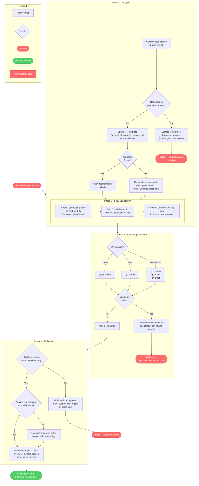

<!-- diagram-meta: {"source": "agents/pr-creator.md", "source_hash": "sha256:ffc88f75b5dfea74c4485cc48ce5e65d04ff458ee7991134097c54505a7bd893", "generated_at": "2026-05-25T01:42:41Z", "generator": "generate_diagrams.py"} -->
# Diagram: pr-creator

**Agent scope** (hard boundaries enforced by guardrails):

| Allowed verbs | Forbidden verbs |
|---|---|
| `gh pr create`, `gh pr edit`, `gh pr view`, `gh pr diff`, `gh pr list` | `gh pr merge`, `gh pr ready`, `git push`, any working-tree mutation |
| `git log`, `git diff`, `git rev-parse`, `git branch` (read-only) | `Edit`, `Write`, `Grep`, `Glob` (not in toolset) |
