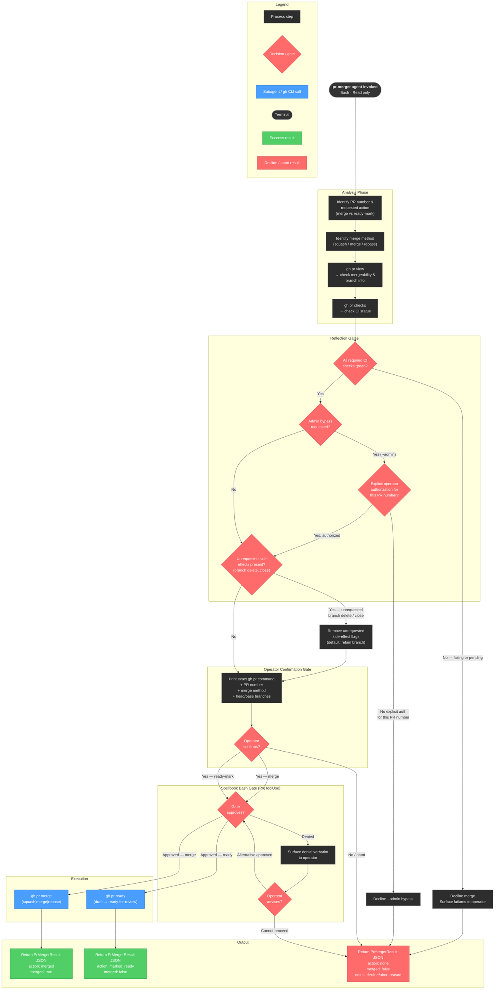

<!-- diagram-meta: {"source": "agents/pr-merger.md", "source_hash": "sha256:ffc88f75b5dfea74c4485cc48ce5e65d04ff458ee7991134097c54505a7bd893", "generated_at": "2026-05-25T01:43:08Z", "generator": "generate_diagrams.py"} -->
# Diagram: pr-merger

## pr-merger Agent — Workflow Diagram

**pr-merger** is a narrow state-mutation agent. It reads PR state, enforces four sequential guardrails (CI green → no unauthorized admin bypass → no unrequested side effects → operator confirmation), passes the composed command through the spellbook bash gate, and executes exactly one of two mutating verbs: `gh pr merge` or `gh pr ready`. Every path that cannot proceed terminates in a `PrMergerResult` with `action: none` and a `notes` field explaining the abort reason.
