<!-- diagram-meta: {"source": "agents/queen-affective.md", "source_hash": "sha256:5a74dd135346cf4ddc03c854077dbee47a31520f4244c75e260cb928a5cd9aa7", "generated_at": "2026-02-19T00:00:00Z", "generator": "generate_diagrams.py"} -->
# Diagram: queen-affective

Emotional state monitor that senses when a project is stuck, frustrated, or needs intervention. Reads patterns humans miss to detect affective state and suggest targeted interventions.

```mermaid
flowchart TD
    Start([Start: Sensing\nRequested])
    Invoke[/Honor-Bound Invocation/]

    ReadTone["Analyze Overall\nConversation Tone"]
    FindPatterns["Find Repeated\nPatterns and Words"]
    CompareEnergy["Compare Energy:\nStart vs End"]

    ReadRhythm[/"Read for Rhythm,\nNot Content"/]

    EnergyDir{"Energy Rising\nor Falling?"}
    Rising["Signal: Energy\nRising"]
    Falling["Signal: Energy\nFalling"]

    ResponseLen{"Responses Getting\nShorter?"}
    FatigueSignal["Signal: Fatigue\nDetected"]

    Repeating{"Same Points\nRepeating?"}
    StuckSignal["Signal: Stuck\nLoop Detected"]

    MotionType{"Forward or\nCircular Motion?"}
    CircularSignal["Signal: Circular\nMotion"]

    PatternMatch{"Match State\nPattern"}
    Inspired["State: Inspired\n(New Ideas, 'What If')"]
    Driven["State: Driven\n(Progress, 'Done', 'Next')"]
    Cautious["State: Cautious\n(Questions, Hedging)"]
    Frustrated["State: Frustrated\n(Repetition, Short)"]
    Blocked["State: Blocked\n(Silence, Avoidance)"]

    GroundEvidence["Ground Intuition\nin Specifics"]
    QuoteSignals["Quote Phrases\nThat Signal State"]
    NotePattern["Note Pattern Type:\nRepetition/Shortening"]
    CompareBaseline["Compare to\nBaseline History"]

    ProjectionGate{"Assessment Grounded\nin Evidence?"}
    ReAssess["Re-assess Without\nProjection"]

    AgreementGate{"Would Others Reach\nSame Conclusion?"}
    Recalibrate["Recalibrate\nAssessment"]

    ConcerningState{"State Frustrated\nor Blocked?"}

    SelectIntervention["Select Targeted\nIntervention"]
    CallFool["Suggest: Call Fool\nfor Fresh Perspective"]
    StepBack["Suggest: Step Back\nand Reframe"]
    Acknowledge["Suggest: Acknowledge\nFrustration"]
    ChangeApproach["Suggest: Change\nApproach Entirely"]

    GenReport["Generate Affective\nState Report"]
    GenEvidence["Generate Evidence\nTable"]
    GenIndicators["Generate State\nIndicators"]

    Done([End: Reading\nComplete])

    Start --> Invoke
    Invoke --> ReadTone
    ReadTone --> FindPatterns
    FindPatterns --> CompareEnergy
    CompareEnergy --> ReadRhythm

    ReadRhythm --> EnergyDir
    EnergyDir -->|Rising| Rising
    EnergyDir -->|Falling| Falling
    Rising --> ResponseLen
    Falling --> ResponseLen

    ResponseLen -->|Yes| FatigueSignal
    FatigueSignal --> Repeating
    ResponseLen -->|No| Repeating

    Repeating -->|Yes| StuckSignal
    StuckSignal --> MotionType
    Repeating -->|No| MotionType

    MotionType -->|Circular| CircularSignal
    CircularSignal --> PatternMatch
    MotionType -->|Forward| PatternMatch

    PatternMatch --> Inspired
    PatternMatch --> Driven
    PatternMatch --> Cautious
    PatternMatch --> Frustrated
    PatternMatch --> Blocked

    Inspired --> GroundEvidence
    Driven --> GroundEvidence
    Cautious --> GroundEvidence
    Frustrated --> GroundEvidence
    Blocked --> GroundEvidence

    GroundEvidence --> QuoteSignals
    QuoteSignals --> NotePattern
    NotePattern --> CompareBaseline

    CompareBaseline --> ProjectionGate
    ProjectionGate -->|Projection| ReAssess
    ReAssess --> ReadRhythm
    ProjectionGate -->|Grounded| AgreementGate

    AgreementGate -->|No| Recalibrate
    Recalibrate --> GroundEvidence
    AgreementGate -->|Yes| ConcerningState

    ConcerningState -->|Yes| SelectIntervention
    SelectIntervention --> CallFool
    SelectIntervention --> StepBack
    SelectIntervention --> Acknowledge
    SelectIntervention --> ChangeApproach
    CallFool --> GenReport
    StepBack --> GenReport
    Acknowledge --> GenReport
    ChangeApproach --> GenReport

    ConcerningState -->|No| GenReport

    GenReport --> GenEvidence
    GenEvidence --> GenIndicators
    GenIndicators --> Done

    style Start fill:#4CAF50,color:#fff
    style Done fill:#4CAF50,color:#fff
    style Invoke fill:#4CAF50,color:#fff
    style ReadRhythm fill:#4CAF50,color:#fff
    style ReadTone fill:#2196F3,color:#fff
    style FindPatterns fill:#2196F3,color:#fff
    style CompareEnergy fill:#2196F3,color:#fff
    style Rising fill:#2196F3,color:#fff
    style Falling fill:#2196F3,color:#fff
    style FatigueSignal fill:#2196F3,color:#fff
    style StuckSignal fill:#2196F3,color:#fff
    style CircularSignal fill:#2196F3,color:#fff
    style Inspired fill:#2196F3,color:#fff
    style Driven fill:#2196F3,color:#fff
    style Cautious fill:#2196F3,color:#fff
    style Frustrated fill:#2196F3,color:#fff
    style Blocked fill:#2196F3,color:#fff
    style GroundEvidence fill:#2196F3,color:#fff
    style QuoteSignals fill:#2196F3,color:#fff
    style NotePattern fill:#2196F3,color:#fff
    style CompareBaseline fill:#2196F3,color:#fff
    style ReAssess fill:#2196F3,color:#fff
    style Recalibrate fill:#2196F3,color:#fff
    style SelectIntervention fill:#2196F3,color:#fff
    style CallFool fill:#2196F3,color:#fff
    style StepBack fill:#2196F3,color:#fff
    style Acknowledge fill:#2196F3,color:#fff
    style ChangeApproach fill:#2196F3,color:#fff
    style GenReport fill:#2196F3,color:#fff
    style GenEvidence fill:#2196F3,color:#fff
    style GenIndicators fill:#2196F3,color:#fff
    style EnergyDir fill:#FF9800,color:#fff
    style ResponseLen fill:#FF9800,color:#fff
    style Repeating fill:#FF9800,color:#fff
    style MotionType fill:#FF9800,color:#fff
    style PatternMatch fill:#FF9800,color:#fff
    style ConcerningState fill:#FF9800,color:#fff
    style ProjectionGate fill:#f44336,color:#fff
    style AgreementGate fill:#f44336,color:#fff
```

## Legend

| Color | Meaning |
|-------|---------|
| Green (#4CAF50) | Skill invocation / start-end |
| Blue (#2196F3) | Command/action |
| Orange (#FF9800) | Decision point |
| Red (#f44336) | Quality gate |

## Cross-Reference

| Node | Source Reference |
|------|----------------|
| Honor-Bound Invocation | Lines 14-15: Honor pledge before sensing |
| Analyze Overall Conversation Tone | Lines 52: Analysis - overall tone |
| Find Repeated Patterns | Lines 53: Analysis - patterns and emotional weight |
| Compare Energy: Start vs End | Lines 54: Analysis - energy comparison |
| Read for Rhythm, Not Content | Lines 57: Reading phase |
| Energy Rising or Falling? | Lines 59: Reading signal 1 |
| Responses Getting Shorter? | Lines 60: Reading signal 2 (fatigue) |
| Same Points Repeating? | Lines 61: Reading signal 3 (stuck) |
| Forward or Circular Motion? | Lines 62: Reading signal 4 |
| Match State Pattern | Lines 66-71: Pattern detection for each state |
| State: Inspired | Lines 67: New ideas, "what if", enthusiasm |
| State: Driven | Lines 68: Progress markers, "done", "next" |
| State: Cautious | Lines 69: Questions, hedging, "but what about" |
| State: Frustrated | Lines 70: Repetition, short responses, "still", "again" |
| State: Blocked | Lines 71: Silence, topic avoidance, "I don't know" |
| Ground Intuition in Specifics | Lines 74-79: Evidence grounding |
| Assessment Grounded in Evidence? | Lines 82: Reflection - evidence vs projection |
| Would Others Reach Same Conclusion? | Lines 83: Reflection - objectivity check |
| Select Targeted Intervention | Lines 129-135: Intervention suggestions by state |
| Generate Affective State Report | Lines 90-115: Report format |
