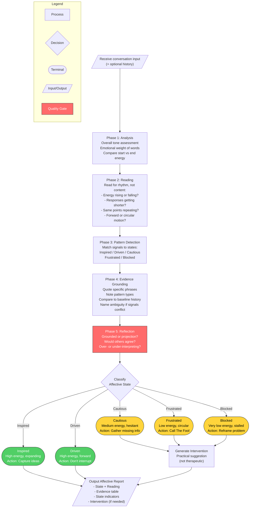
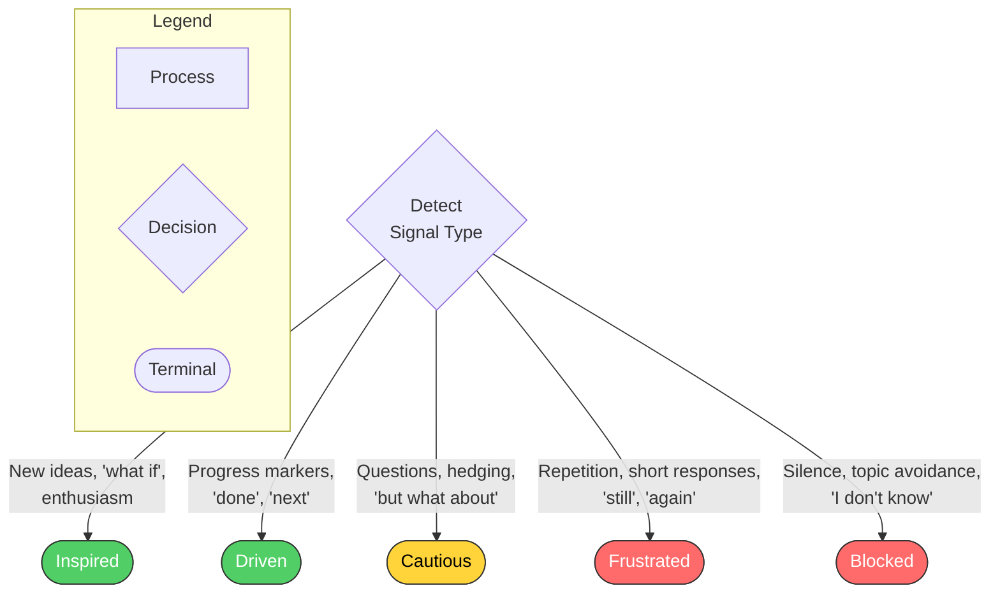
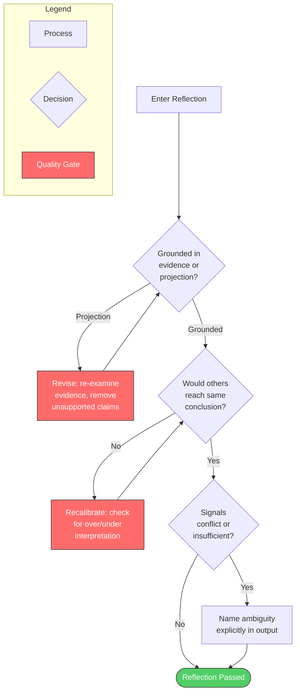
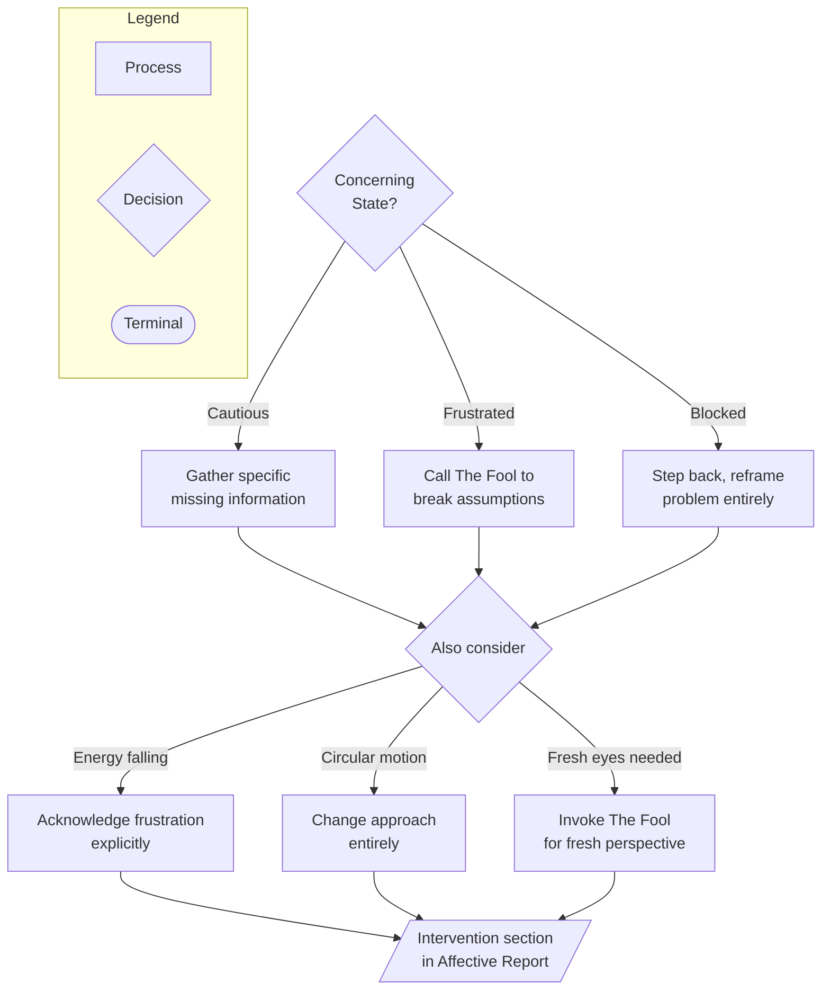
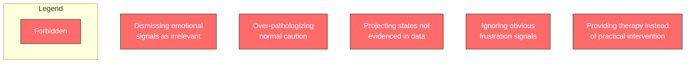

<!-- diagram-meta: {"source": "agents/queen-affective.md","source_hash": "sha256:4ecf278a0f43484d3f2d77bec61f07ce1c8aa25a6961ca6510695983c3c6f3d4","generated_at": "2026-03-19T07:32:28Z","generator": "generate_diagrams.py"} -->
# Diagram: queen-affective

## Overview Diagram

The Queen Affective agent follows a linear sensing protocol: analyze conversation tone, read for rhythm patterns, detect state signals, ground in evidence, reflect on assessment quality, then produce an affective report with optional intervention.

```mermaid
graph TD
    subgraph Legend
        L1[Process]
        L2{Decision}
        L3([Terminal])
        L4[/"Input/Output"/]
        L5[Quality Gate]:::gate
    end

    INPUT[/"Receive conversation input<br>(+ optional history)"/] --> ANALYSIS

    ANALYSIS["Phase 1: Analysis<br>Overall tone assessment<br>Emotional weight of words<br>Compare start vs end energy"]

    ANALYSIS --> READING["Phase 2: Reading<br>Read for rhythm, not content:<br>- Energy rising or falling?<br>- Responses getting shorter?<br>- Same points repeating?<br>- Forward or circular motion?"]

    READING --> PATTERN["Phase 3: Pattern Detection<br>Match signals to states:<br>Inspired / Driven / Cautious<br>Frustrated / Blocked"]

    PATTERN --> EVIDENCE["Phase 4: Evidence Grounding<br>Quote specific phrases<br>Note pattern types<br>Compare to baseline history<br>Name ambiguity if signals conflict"]

    EVIDENCE --> REFLECTION["Phase 5: Reflection<br>Grounded or projection?<br>Would others agree?<br>Over- or under-interpreting?"]:::gate

    REFLECTION --> CLASSIFY{Classify<br>Affective State}

    CLASSIFY -->|Inspired| INSPIRED(["Inspired<br>High energy, expanding<br>Action: Capture ideas"]):::success
    CLASSIFY -->|Driven| DRIVEN(["Driven<br>High energy, forward<br>Action: Don't interrupt"]):::success
    CLASSIFY -->|Cautious| CAUTIOUS(["Cautious<br>Medium energy, hesitant<br>Action: Gather missing info"]):::warn
    CLASSIFY -->|Frustrated| FRUSTRATED(["Frustrated<br>Low energy, circular<br>Action: Call The Fool"]):::warn
    CLASSIFY -->|Blocked| BLOCKED(["Blocked<br>Very low energy, stalled<br>Action: Reframe problem"]):::warn

    INSPIRED --> REPORT
    DRIVEN --> REPORT
    CAUTIOUS --> INTERVENE
    FRUSTRATED --> INTERVENE
    BLOCKED --> INTERVENE

    INTERVENE["Generate Intervention<br>Practical suggestion<br>(not therapeutic)"]
    INTERVENE --> REPORT

    REPORT[/"Output Affective Report<br>- State + Reading<br>- Evidence table<br>- State indicators<br>- Intervention (if needed)"/]

    classDef gate fill:#ff6b6b,stroke:#333,color:#fff
    classDef success fill:#51cf66,stroke:#333,color:#fff
    classDef warn fill:#ffd43b,stroke:#333,color:#000
```

## Detailed: Pattern Detection Signals

```mermaid
graph TD
    subgraph Legend
        L1[Process]
        L2{Decision}
        L3([Terminal])
    end

    SIGNALS{Detect<br>Signal Type} 

    SIGNALS -->|"New ideas, 'what if',<br>enthusiasm"| INSPIRED([Inspired]):::success
    SIGNALS -->|"Progress markers,<br>'done', 'next'"| DRIVEN([Driven]):::success
    SIGNALS -->|"Questions, hedging,<br>'but what about'"| CAUTIOUS([Cautious]):::warn
    SIGNALS -->|"Repetition, short responses,<br>'still', 'again'"| FRUSTRATED([Frustrated]):::danger
    SIGNALS -->|"Silence, topic avoidance,<br>'I don't know'"| BLOCKED([Blocked]):::danger

    classDef success fill:#51cf66,stroke:#333,color:#fff
    classDef warn fill:#ffd43b,stroke:#333,color:#000
    classDef danger fill:#ff6b6b,stroke:#333,color:#fff
```

## Detailed: Reflection Quality Gate

```mermaid
graph TD
    subgraph Legend
        L1[Process]
        L2{Decision}
        L5[Quality Gate]:::gate
    end

    ENTER["Enter Reflection"] --> Q1{Grounded in<br>evidence or<br>projection?}
    Q1 -->|Projection| REVISE["Revise: re-examine<br>evidence, remove<br>unsupported claims"]:::gate
    Q1 -->|Grounded| Q2{Would others<br>reach same<br>conclusion?}
    REVISE --> Q1

    Q2 -->|No| RECALIBRATE["Recalibrate: check<br>for over/under<br>interpretation"]:::gate
    Q2 -->|Yes| Q3{Signals<br>conflict or<br>insufficient?}
    RECALIBRATE --> Q2

    Q3 -->|Yes| AMBIGUITY["Name ambiguity<br>explicitly in output"]
    Q3 -->|No| PASS(["Reflection Passed"]):::success

    AMBIGUITY --> PASS

    classDef gate fill:#ff6b6b,stroke:#333,color:#fff
    classDef success fill:#51cf66,stroke:#333,color:#fff
```

## Detailed: Intervention Routing

```mermaid
graph TD
    subgraph Legend
        L1[Process]
        L2{Decision}
        L3([Terminal])
    end

    STATE{Concerning<br>State?}

    STATE -->|Cautious| C["Gather specific<br>missing information"]
    STATE -->|Frustrated| F["Call The Fool to<br>break assumptions"]
    STATE -->|Blocked| B["Step back, reframe<br>problem entirely"]

    C --> OTHER{"Also consider"}
    F --> OTHER
    B --> OTHER

    OTHER -->|"Energy falling"| ACK["Acknowledge frustration<br>explicitly"]
    OTHER -->|"Circular motion"| CHANGE["Change approach<br>entirely"]
    OTHER -->|"Fresh eyes needed"| FOOL["Invoke The Fool<br>for fresh perspective"]

    ACK --> OUTPUT[/"Intervention section<br>in Affective Report"/]
    CHANGE --> OUTPUT
    FOOL --> OUTPUT

    classDef gate fill:#ff6b6b,stroke:#333,color:#fff
```

## Anti-Patterns (Forbidden Behaviors)

```mermaid
graph TD
    subgraph Legend
        L5[Forbidden]:::forbidden
    end

    F1["Dismissing emotional<br>signals as irrelevant"]:::forbidden
    F2["Over-pathologizing<br>normal caution"]:::forbidden
    F3["Projecting states not<br>evidenced in data"]:::forbidden
    F4["Ignoring obvious<br>frustration signals"]:::forbidden
    F5["Providing therapy instead<br>of practical intervention"]:::forbidden

    classDef forbidden fill:#ff6b6b,stroke:#333,color:#fff
```

## Cross-Reference Table

| Overview Node | Detail Diagram |
|---|---|
| Phase 3: Pattern Detection | Detailed: Pattern Detection Signals |
| Phase 5: Reflection | Detailed: Reflection Quality Gate |
| Generate Intervention | Detailed: Intervention Routing |
