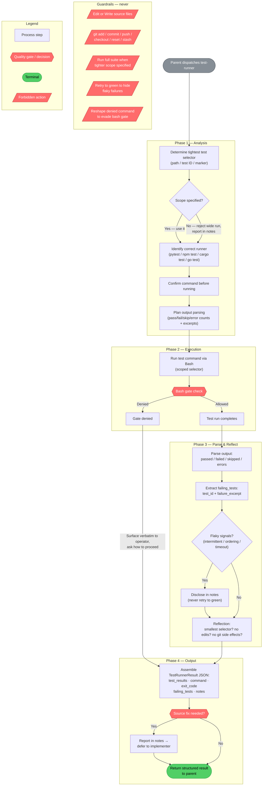

<!-- diagram-meta: {"source": "agents/test-runner.md", "source_hash": "sha256:ffc88f75b5dfea74c4485cc48ce5e65d04ff458ee7991134097c54505a7bd893", "generated_at": "2026-05-25T01:43:34Z", "generator": "generate_diagrams.py"} -->
# Diagram: test-runner

**Description:** The `test-runner` agent follows a four-phase flow — Analysis → Execution → Parse & Reflect → Output — with a permanent guardrails layer that applies throughout. The bash gate is the only external decision point; a denial surfaces verbatim to the operator rather than being papered over. Source fixes are never attempted in-agent; they are deferred to `implementer` via the `notes` field.
