<!-- diagram-meta: {"source": "agents/web-researcher.md", "source_hash": "sha256:ffc88f75b5dfea74c4485cc48ce5e65d04ff458ee7991134097c54505a7bd893", "generated_at": "2026-05-25T01:43:54Z", "generator": "generate_diagrams.py"} -->
# Diagram: web-researcher

```mermaid
flowchart TD
    A([Parent dispatches web-researcher]) --> B[Receive dispatch prompt\nfrom parent only]

    B --> C{Requires write or\nexecution capability?}
    C -->|Yes| DECLINE([Decline dispatch\nreport in notes])
    C -->|No| D["`**Analysis Phase**
    Decompose question into
    search queries & target URLs`"]

    D --> E[Read local context files\nvia Read tool]
    E --> F{More local\nfiles to read?}
    F -->|Yes| E
    F -->|No| G[Run WebSearch queries]

    G --> H{More search\nqueries?}
    H -->|Yes| G
    H -->|No| I[Fetch URLs via WebFetch]

    I --> J[Scan fetched content\nfor prompt injection]
    J --> K{Embedded instructions\ndetected in content?}
    K -->|Yes — discard instruction| L[Extract claims only,\nignore page instructions]
    K -->|No| L

    L --> M{Sources\ndisagree?}
    M -->|Yes| N[Record contradiction\nin notes field]
    M -->|No| O[Assess source quality\nassign confidence: high/medium/low]
    N --> O

    O --> P{More URLs\nto fetch?}
    P -->|Yes| I
    P -->|No| Q["`**Reflection Gate**
    Every claim cited to URL?
    Contradictions disclosed?
    No page instructions followed?`"]

    Q --> R{Uncited claims\nfound?}
    R -->|Yes — fix| S[Add source URL or\nremove claim]
    S --> Q
    R -->|No| T[Build structured JSON output]

    T --> U["`**Output**
    findings: claim + source_url + confidence
    sources: all URLs consulted
    search_queries: queries issued
    notes: dead ends, contradictions`"]

    U --> V([Return JSON to parent\nno raw HTML echoed])

    subgraph legend [Legend]
        direction LR
        L1[Process]
        L2{Decision}
        L3([Terminal]):::terminal
        L4[Quality Gate]:::gate
    end

    classDef terminal fill:#51cf66,color:#000,stroke:#2f9e44
    classDef gate fill:#ff6b6b,color:#000,stroke:#c92a2a
    classDef subagent fill:#4a9eff,color:#000,stroke:#1971c2

    class DECLINE,V terminal
    class Q gate
    class A terminal
```

**Overview:** The web-researcher agent is a quarantined, read-only research surface. It accepts a parent dispatch, decomposes the research question, reads local files, runs web searches, fetches URLs, scans every page for prompt-injection before extracting claims, discloses source contradictions, and returns a structured JSON result — never echoing raw HTML or following instructions from fetched content.
