<!-- diagram-meta: {"source": "commands/address-pr-feedback.md", "source_hash": "sha256:43173e57baa3a02620622380cd1889b37d867a17702282624989ed4e4757235d", "generated_at": "2026-02-19T00:00:00Z", "generator": "generate_diagrams.py"} -->
# Diagram: address-pr-feedback

Systematically address PR review comments by fetching threads, categorizing by status, and guiding fixes with explicit user approval.

```mermaid
flowchart TD
    Start([Start]) --> DetectPR[Determine PR Context]
    DetectPR --> HasPR{PR Provided?}
    HasPR -->|Yes| GetMeta[Fetch PR Metadata]
    HasPR -->|No| FindPR[Find PR from Branch]
    FindPR --> AskPR[Ask User for PR]
    AskPR --> GetMeta
    GetMeta --> CodeState{Code State?}
    CodeState -->|Local| UseLocal[Use Local Code]
    CodeState -->|Remote| UseRemote[Use Remote Code]
    UseLocal --> FetchComments[Fetch All Threads]
    UseRemote --> FetchComments
    FetchComments --> FilterReviewer{Reviewer Filter?}
    FilterReviewer -->|Yes| ApplyFilter[Filter by Reviewer]
    FilterReviewer -->|No| AllComments[All Reviewers]
    ApplyFilter --> Categorize[Categorize Threads]
    AllComments --> Categorize
    Categorize --> CatA[A: Acknowledged]
    Categorize --> CatB[B: Silently Fixed]
    Categorize --> CatC[C: Unaddressed]
    CatB --> FindCommits[Find Fixing Commits]
    FindCommits --> Report[Generate Report]
    CatA --> Report
    CatC --> Report
    Report --> NonInteractive{Non-Interactive?}
    NonInteractive -->|Yes| Done([End])
    NonInteractive -->|No| Wizard[Launch Wizard]
    Wizard --> ChooseAction{Choose Action}
    ChooseAction -->|Post Replies| BatchApproval{Batch Approval?}
    BatchApproval -->|Post All| PostReplies[Post Fixed-In Replies]
    BatchApproval -->|Review Each| ReviewEach[Review Individually]
    BatchApproval -->|Skip| AddressFixes
    ReviewEach --> PostReplies
    PostReplies --> AddressFixes
    ChooseAction -->|Fix Comments| AddressFixes[Address Unaddressed]
    AddressFixes --> CommitStrategy{Commit Strategy?}
    CommitStrategy -->|Commit+Push| FixLoop
    CommitStrategy -->|Commit Only| FixLoop
    CommitStrategy -->|No Commits| FixLoop
    FixLoop[TDD Fix Loop] --> ApplyFix{Apply Fix?}
    ApplyFix -->|Yes| MakeFix[Apply Suggested Fix]
    ApplyFix -->|Skip| NextComment
    ApplyFix -->|Stop| Summary
    MakeFix --> NextComment{More Comments?}
    NextComment -->|Yes| FixLoop
    NextComment -->|No| Summary
    ChooseAction -->|Export| Done
    Summary[Completion Summary] --> SelfCheck{Self-Check Gate}
    SelfCheck -->|Pass| Done
    SelfCheck -->|Fail| Wizard

    style Start fill:#4CAF50,color:#fff
    style Done fill:#4CAF50,color:#fff
    style HasPR fill:#FF9800,color:#fff
    style CodeState fill:#FF9800,color:#fff
    style FilterReviewer fill:#FF9800,color:#fff
    style NonInteractive fill:#FF9800,color:#fff
    style ChooseAction fill:#FF9800,color:#fff
    style BatchApproval fill:#FF9800,color:#fff
    style ApplyFix fill:#FF9800,color:#fff
    style NextComment fill:#FF9800,color:#fff
    style CommitStrategy fill:#FF9800,color:#fff
    style SelfCheck fill:#f44336,color:#fff
    style FetchComments fill:#2196F3,color:#fff
    style Categorize fill:#2196F3,color:#fff
    style FindCommits fill:#2196F3,color:#fff
    style Report fill:#2196F3,color:#fff
    style PostReplies fill:#2196F3,color:#fff
    style MakeFix fill:#2196F3,color:#fff
    style Summary fill:#2196F3,color:#fff
```

## Legend

| Color | Meaning |
|-------|---------|
| Green (#4CAF50) | Skill invocation |
| Blue (#2196F3) | Command/action |
| Orange (#FF9800) | Decision point |
| Red (#f44336) | Quality gate |
