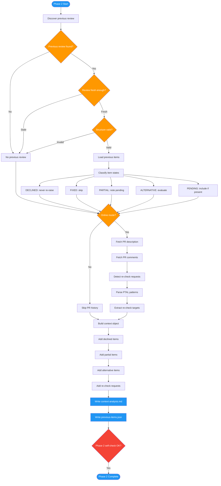

<!-- diagram-meta: {"source": "commands/advanced-code-review-context.md", "source_hash": "sha256:90257d354a931fb6891f8f90536858608cd6108164937efa81b52d06eee4d22f", "generated_at": "2026-02-19T00:00:00Z", "generator": "generate_diagrams.py"} -->
# Diagram: advanced-code-review-context

Phase 2 of advanced-code-review: Context analysis that discovers previous reviews, loads item states, fetches PR history, detects re-check requests, and builds the context object for the deep review phase.

## Legend

| Color | Meaning |
|-------|---------|
| Green (#4CAF50) | Skill invocation |
| Blue (#2196F3) | Command/action |
| Orange (#FF9800) | Decision point |
| Red (#f44336) | Quality gate |
