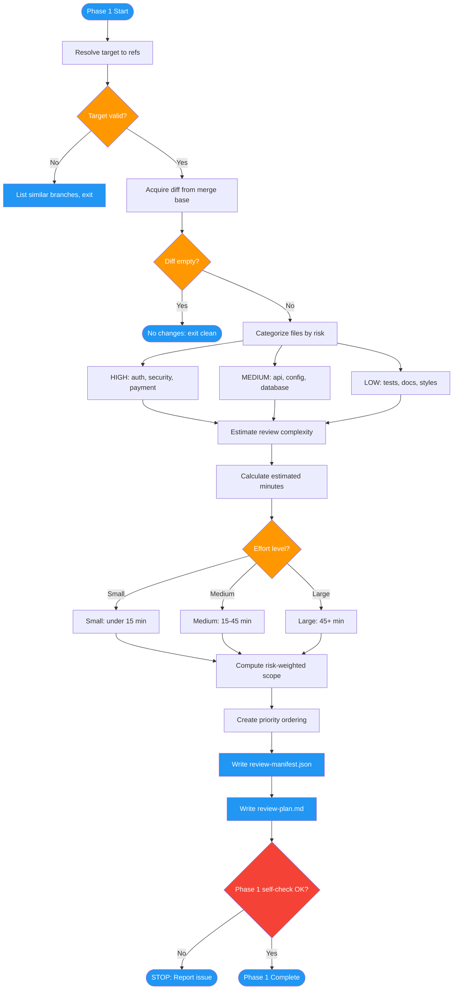

<!-- diagram-meta: {"source": "commands/advanced-code-review-plan.md", "source_hash": "sha256:bae4e46252e6d88dc0a7606d0986b319a5d1a40c940ec8b27b7c8305a92edfac", "generated_at": "2026-02-19T00:00:00Z", "generator": "generate_diagrams.py"} -->
# Diagram: advanced-code-review-plan

Phase 1 of advanced-code-review: Strategic planning that resolves the review target, acquires the diff, categorizes files by risk, estimates complexity, and produces a prioritized review manifest and plan.

## Legend

| Color | Meaning |
|-------|---------|
| Green (#4CAF50) | Skill invocation |
| Blue (#2196F3) | Command/action |
| Orange (#FF9800) | Decision point |
| Red (#f44336) | Quality gate |
