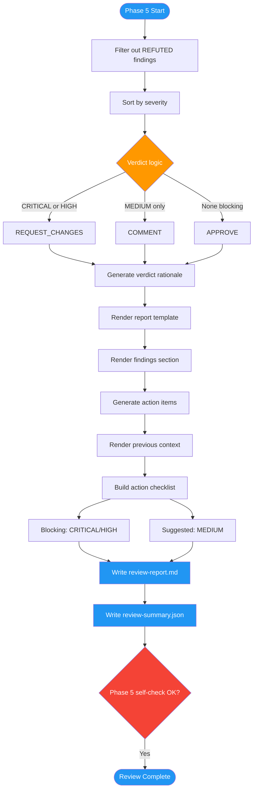

<!-- diagram-meta: {"source": "commands/advanced-code-review-report.md", "source_hash": "sha256:b8b507d034435bc313b70e7467dc7aa0b8337bae348ca6eb41ef6ce103eb6ae1", "generated_at": "2026-02-19T00:00:00Z", "generator": "generate_diagrams.py"} -->
# Diagram: advanced-code-review-report

Phase 5 of advanced-code-review: Report generation that filters verified findings, determines verdict, renders the final Markdown report and machine-readable JSON summary with action items.

## Legend

| Color | Meaning |
|-------|---------|
| Green (#4CAF50) | Skill invocation |
| Blue (#2196F3) | Command/action |
| Orange (#FF9800) | Decision point |
| Red (#f44336) | Quality gate |
