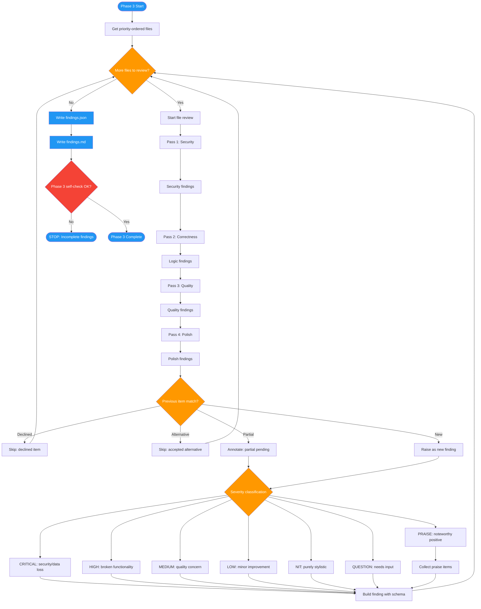

<!-- diagram-meta: {"source": "commands/advanced-code-review-review.md", "source_hash": "sha256:18de2671236d63c2a7e5d45f8a26d45193ab3b97f31f5377e4b2436c31e2cc44", "generated_at": "2026-02-19T00:00:00Z", "generator": "generate_diagrams.py"} -->
# Diagram: advanced-code-review-review

Phase 3 of advanced-code-review: Deep multi-pass code review that analyzes each file through security, correctness, quality, and polish passes, integrates previous item context, and generates structured findings.

## Legend

| Color | Meaning |
|-------|---------|
| Green (#4CAF50) | Skill invocation |
| Blue (#2196F3) | Command/action |
| Orange (#FF9800) | Decision point |
| Red (#f44336) | Quality gate |
