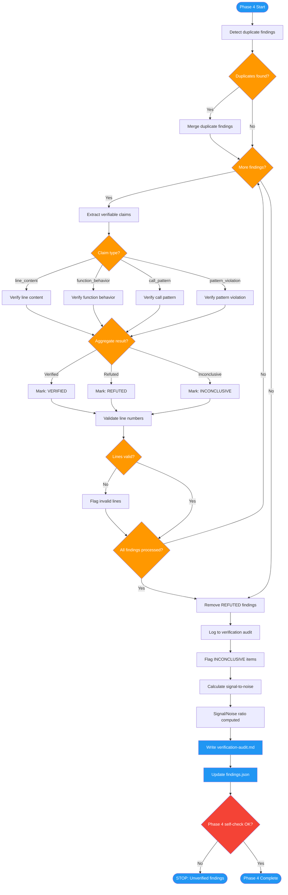

<!-- diagram-meta: {"source": "commands/advanced-code-review-verify.md", "source_hash": "sha256:f1d0fb4d4c0ba54f1564bba26b2ead12e0f3da4ff326c06128c450e5fdcd872b", "generated_at": "2026-02-19T00:00:00Z", "generator": "generate_diagrams.py"} -->
# Diagram: advanced-code-review-verify

Phase 4 of advanced-code-review: Verification that fact-checks every finding against the actual codebase, removes false positives, flags inconclusive items, detects duplicates, and calculates signal-to-noise ratio.

## Legend

| Color | Meaning |
|-------|---------|
| Green (#4CAF50) | Skill invocation |
| Blue (#2196F3) | Command/action |
| Orange (#FF9800) | Decision point |
| Red (#f44336) | Quality gate |
