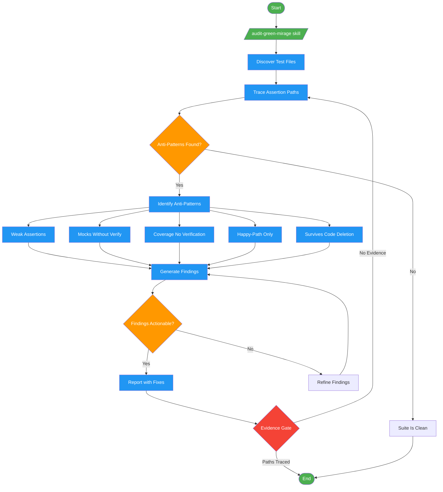

<!-- diagram-meta: {"source": "commands/audit-green-mirage.md", "source_hash": "sha256:072111a5bcefa4bf14f8afad6fdadf97e0ac499b4945e3016341bc8beab97c60", "generated_at": "2026-02-19T00:00:00Z", "generator": "generate_diagrams.py"} -->
# Diagram: audit-green-mirage

Audit test suites for Green Mirage anti-patterns: tests that pass but do not verify behavior.

## Legend

| Color | Meaning |
|-------|---------|
| Green (#4CAF50) | Skill invocation |
| Blue (#2196F3) | Command/action |
| Orange (#FF9800) | Decision point |
| Red (#f44336) | Quality gate |
