<!-- diagram-meta: {"source": "commands/audit-mirage-analyze.md", "source_hash": "sha256:88b213faef8d8c5f4e12793ab9dc94f4c0e28261cedf9f54b9e128e3e4e085d5", "generated_at": "2026-02-19T00:00:00Z", "generator": "generate_diagrams.py"} -->
# Diagram: audit-mirage-analyze

Systematic line-by-line audit of test functions against 8 Green Mirage Patterns.

```mermaid
flowchart TD
    Start([Start: Test Files Identified]) --> SelectFile[Select Next Test File]
    SelectFile --> SelectTest[Select Next Test Function]

    SelectTest --> Purpose[Identify Test Purpose]
    Purpose --> Setup[Analyze Setup Lines]
    Setup --> Action[Analyze Action Lines]
    Action --> Trace[Trace Complete Code Path]

    Trace --> Assertions[Analyze Each Assertion]

    Assertions --> P1{Pattern 1: Existence vs Validity?}
    P1 --> P2{Pattern 2: Partial Assertions?}
    P2 --> P3{Pattern 3: Shallow Matching?}
    P3 --> P4{Pattern 4: Lack of Consumption?}
    P4 --> P5{Pattern 5: Mocking Reality?}
    P5 --> P6{Pattern 6: Swallowed Errors?}
    P6 --> P7{Pattern 7: State Mutation Unverified?}
    P7 --> P8{Pattern 8: Incomplete Branches?}

    P8 --> Verdict{Test Verdict?}
    Verdict -->|No Patterns| Solid[SOLID]
    Verdict -->|Some Patterns| Partial[PARTIAL]
    Verdict -->|Many Patterns| Mirage[GREEN MIRAGE]

    Solid --> EstEffort[Estimate Fix Effort]
    Partial --> EstEffort
    Mirage --> EstEffort

    EstEffort --> MoreTests{More Tests in File?}
    MoreTests -->|Yes| SelectTest
    MoreTests -->|No| MoreFiles{More Test Files?}
    MoreFiles -->|Yes| SelectFile
    MoreFiles -->|No| Done([All Tests Audited])

    style Start fill:#2196F3,color:#fff
    style SelectFile fill:#2196F3,color:#fff
    style SelectTest fill:#2196F3,color:#fff
    style Purpose fill:#2196F3,color:#fff
    style Setup fill:#2196F3,color:#fff
    style Action fill:#2196F3,color:#fff
    style Trace fill:#2196F3,color:#fff
    style Assertions fill:#2196F3,color:#fff
    style P1 fill:#FF9800,color:#fff
    style P2 fill:#FF9800,color:#fff
    style P3 fill:#FF9800,color:#fff
    style P4 fill:#FF9800,color:#fff
    style P5 fill:#FF9800,color:#fff
    style P6 fill:#FF9800,color:#fff
    style P7 fill:#FF9800,color:#fff
    style P8 fill:#FF9800,color:#fff
    style Verdict fill:#FF9800,color:#fff
    style Solid fill:#4CAF50,color:#fff
    style Partial fill:#FF9800,color:#fff
    style Mirage fill:#f44336,color:#fff
    style EstEffort fill:#2196F3,color:#fff
    style MoreTests fill:#FF9800,color:#fff
    style MoreFiles fill:#FF9800,color:#fff
    style Done fill:#2196F3,color:#fff
```

## Legend

| Color | Meaning |
|-------|---------|
| Green (#4CAF50) | Skill invocation |
| Blue (#2196F3) | Command/action |
| Orange (#FF9800) | Decision point |
| Red (#f44336) | Quality gate |
