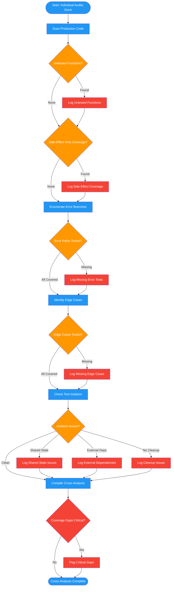

<!-- diagram-meta: {"source": "commands/audit-mirage-cross.md", "source_hash": "sha256:930a9d7002e59050a8bbe3e8b7b6fc8ae2b56e25803034cb89ffbb857df72465", "generated_at": "2026-02-19T00:00:00Z", "generator": "generate_diagrams.py"} -->
# Diagram: audit-mirage-cross

Cross-test suite-level analysis after individual test audits.

## Legend

| Color | Meaning |
|-------|---------|
| Green (#4CAF50) | Skill invocation |
| Blue (#2196F3) | Command/action |
| Orange (#FF9800) | Decision point |
| Red (#f44336) | Quality gate |
