<!-- diagram-meta: {"source": "commands/audit-mirage-report.md", "source_hash": "sha256:23bdb12d9f16cfc254fa6841a3c4e8a7c1ddd1eaf4a2383799092c6f184c728a", "generated_at": "2026-02-19T00:00:00Z", "generator": "generate_diagrams.py"} -->
# Diagram: audit-mirage-report

Generate findings report with machine-parseable YAML and human-readable summary.

```mermaid
flowchart TD
    Start([Start: Audit Data Collected]) --> YAML[Generate YAML Block]

    YAML --> Metadata[Write Audit Metadata]
    Metadata --> Summary[Write Summary Counts]
    Summary --> Patterns[Write Pattern Counts]
    Patterns --> Findings[Write Each Finding]

    Findings --> DepDetect{Dependencies Between Findings?}
    DepDetect -->|Shared Fixtures| LinkDeps[Link depends_on Fields]
    DepDetect -->|Cascading| LinkDeps
    DepDetect -->|Independent| Remediation

    LinkDeps --> Remediation[Build Remediation Plan]
    Remediation --> Phases[Order into Fix Phases]
    Phases --> Effort[Estimate Total Effort]

    Effort --> Human[Generate Human Summary]
    Human --> DetailedFindings[Write Detailed Findings]

    DetailedFindings --> EachFinding[For Each Critical Finding]
    EachFinding --> ShowCode[Show Current Code]
    ShowCode --> ShowBlind[Show Blind Spot]
    ShowBlind --> ShowTrace[Show Failure Trace]
    ShowTrace --> ShowFix[Show Consumption Fix]

    ShowFix --> MoreFindings{More Findings?}
    MoreFindings -->|Yes| EachFinding
    MoreFindings -->|No| WritePath[Compute Output Path]

    WritePath --> ProjectEncode[Project-Encode Path]
    ProjectEncode --> Gate{Report Self-Contained?}
    Gate -->|No| AddContext[Add Missing Context]
    AddContext --> Gate
    Gate -->|Yes| WriteFile[Write Report File]

    WriteFile --> OutputSummary[Show Next Steps]
    OutputSummary --> FixTests[/Suggest: fixing-tests/]
    FixTests --> Done([Report Complete])

    style Start fill:#2196F3,color:#fff
    style YAML fill:#2196F3,color:#fff
    style Metadata fill:#2196F3,color:#fff
    style Summary fill:#2196F3,color:#fff
    style Patterns fill:#2196F3,color:#fff
    style Findings fill:#2196F3,color:#fff
    style DepDetect fill:#FF9800,color:#fff
    style LinkDeps fill:#2196F3,color:#fff
    style Remediation fill:#2196F3,color:#fff
    style Phases fill:#2196F3,color:#fff
    style Effort fill:#2196F3,color:#fff
    style Human fill:#2196F3,color:#fff
    style DetailedFindings fill:#2196F3,color:#fff
    style EachFinding fill:#2196F3,color:#fff
    style ShowCode fill:#2196F3,color:#fff
    style ShowBlind fill:#2196F3,color:#fff
    style ShowTrace fill:#2196F3,color:#fff
    style ShowFix fill:#2196F3,color:#fff
    style MoreFindings fill:#FF9800,color:#fff
    style WritePath fill:#2196F3,color:#fff
    style ProjectEncode fill:#2196F3,color:#fff
    style Gate fill:#f44336,color:#fff
    style AddContext fill:#2196F3,color:#fff
    style WriteFile fill:#2196F3,color:#fff
    style OutputSummary fill:#2196F3,color:#fff
    style FixTests fill:#4CAF50,color:#fff
    style Done fill:#2196F3,color:#fff
```

## Legend

| Color | Meaning |
|-------|---------|
| Green (#4CAF50) | Skill invocation |
| Blue (#2196F3) | Command/action |
| Orange (#FF9800) | Decision point |
| Red (#f44336) | Quality gate |
