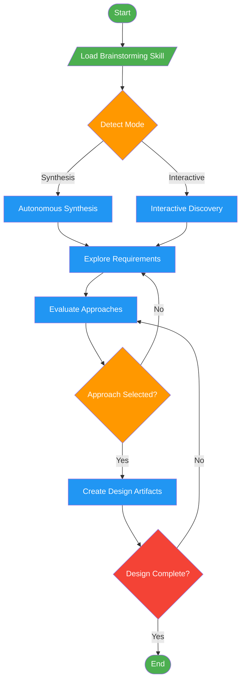

<!-- diagram-meta: {"source": "commands/brainstorm.md", "source_hash": "sha256:9f1f8427a673ec1375ffcf32ff7a296dd24505ac12a6ae2def464fa438986ef0", "generated_at": "2026-02-19T00:00:00Z", "generator": "generate_diagrams.py"} -->
# Diagram: brainstorm

Enforce structured exploration before creative work by delegating to the brainstorming skill.

## Legend

| Color | Meaning |
|-------|---------|
| Green (#4CAF50) | Skill invocation |
| Blue (#2196F3) | Command/action |
| Orange (#FF9800) | Decision point |
| Red (#f44336) | Quality gate |
