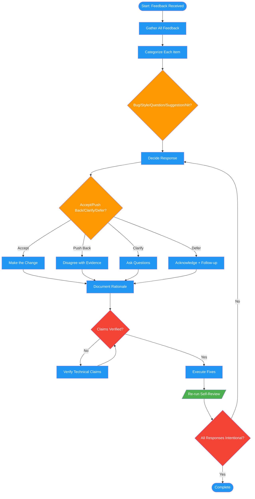

<!-- diagram-meta: {"source": "commands/code-review-feedback.md", "source_hash": "sha256:00b7e60cfbc8801a1c22758c090288b2f63dcf784031fcd9f80f333f5aaea1c4", "generated_at": "2026-02-19T00:00:00Z", "generator": "generate_diagrams.py"} -->
# Diagram: code-review-feedback

Process received code review feedback with categorization, decision rationale, and response templates.

## Legend

| Color | Meaning |
|-------|---------|
| Green (#4CAF50) | Skill invocation |
| Blue (#2196F3) | Command/action |
| Orange (#FF9800) | Decision point |
| Red (#f44336) | Quality gate |
