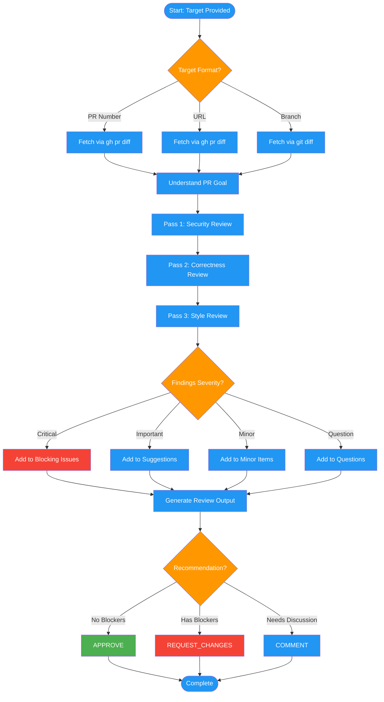

<!-- diagram-meta: {"source": "commands/code-review-give.md", "source_hash": "sha256:a388a4436efc0f6a865a259c374fc30cea084e296ab486eccf5344edfeefea2a", "generated_at": "2026-02-19T00:00:00Z", "generator": "generate_diagrams.py"} -->
# Diagram: code-review-give

Review someone else's code with multi-pass analysis and structured recommendations.

## Legend

| Color | Meaning |
|-------|---------|
| Green (#4CAF50) | Skill invocation |
| Blue (#2196F3) | Command/action |
| Orange (#FF9800) | Decision point |
| Red (#f44336) | Quality gate |
