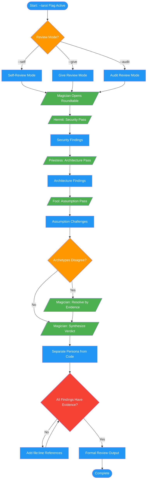

<!-- diagram-meta: {"source": "commands/code-review-tarot.md", "source_hash": "sha256:8c9398311f3594ec3d53460cb63752475a18570f62d3b62bd9d149b8b79be78c", "generated_at": "2026-02-19T00:00:00Z", "generator": "generate_diagrams.py"} -->
# Diagram: code-review-tarot

Roundtable dialogue with tarot archetype personas for all code review modes.

## Legend

| Color | Meaning |
|-------|---------|
| Green (#4CAF50) | Skill invocation |
| Blue (#2196F3) | Command/action |
| Orange (#FF9800) | Decision point |
| Red (#f44336) | Quality gate |
