<!-- diagram-meta: {"source": "commands/crystallize.md", "source_hash": "sha256:aa36cd90ea3a2f44991c0ea9eaff931a8bb722473191d1d2a4c367c13811f032", "generated_at": "2026-02-19T00:00:00Z", "generator": "generate_diagrams.py"} -->
# Diagram: crystallize

Transform verbose SOPs into high-performance agentic prompts via principled compression across five phases with iterative verification.

```mermaid
flowchart TD
    Start([Start]) --> ReadContent[Read Entire Content]
    ReadContent --> P1[Phase 1: Deep Understanding]
    P1 --> MapStructure[Map Structure]
    MapStructure --> CategorizeSections[Categorize Sections]
    CategorizeSections --> VerifyRefs[Verify Cross-References]
    VerifyRefs --> P2[Phase 2: Gap Analysis]
    P2 --> AuditIE[Instruction Engineering Audit]
    AuditIE --> ErrorPaths[Error Path Coverage]
    ErrorPaths --> Ambiguity[Ambiguity Detection]
    Ambiguity --> P3[Phase 3: Improvement Design]
    P3 --> AddAnchors[Add Missing Anchors]
    AddAnchors --> AddExamples[Add Missing Examples]
    AddExamples --> FixRefs[Fix Stale References]
    FixRefs --> P4[Phase 4: Compression]
    P4 --> IdentifyLoad[Identify Load-Bearing]
    IdentifyLoad --> CompressRedundant[Compress Redundant Prose]
    CompressRedundant --> PreCrystGate{Pre-Crystallization Gate}
    PreCrystGate -->|Fail| RestoreContent[Restore Missing Content]
    RestoreContent --> CompressRedundant
    PreCrystGate -->|Pass| P45[Phase 4.5: Iteration Loop]
    P45 --> SelfReview{Self-Review Pass?}
    SelfReview -->|Fail + Iterations Left| FixIssues[Fix Identified Issues]
    FixIssues --> SelfReview
    SelfReview -->|Fail + Max Reached| HaltReport[Halt and Report]
    HaltReport --> Done([End])
    SelfReview -->|Pass| P5[Phase 5: Verification]
    P5 --> StructuralCheck[Structural Integrity]
    StructuralCheck --> LoadBearingCheck[Load-Bearing Check]
    LoadBearingCheck --> EmotionalCheck[Emotional Architecture]
    EmotionalCheck --> PostSynth{Post-Synthesis Gate}
    PostSynth -->|Token < 80%| HaltLoss[Halt: Content Loss]
    PostSynth -->|Pass| QAAudit{QA Audit Gate}
    QAAudit -->|MUST RESTORE| RestoreQA[Restore Missing Items]
    RestoreQA --> QAAudit
    QAAudit -->|Pass| Deliver[Deliver Output]
    Deliver --> Done

    style Start fill:#4CAF50,color:#fff
    style Done fill:#4CAF50,color:#fff
    style PreCrystGate fill:#f44336,color:#fff
    style SelfReview fill:#f44336,color:#fff
    style PostSynth fill:#f44336,color:#fff
    style QAAudit fill:#f44336,color:#fff
    style P1 fill:#2196F3,color:#fff
    style P2 fill:#2196F3,color:#fff
    style P3 fill:#2196F3,color:#fff
    style P4 fill:#2196F3,color:#fff
    style P45 fill:#2196F3,color:#fff
    style P5 fill:#2196F3,color:#fff
    style ReadContent fill:#2196F3,color:#fff
    style MapStructure fill:#2196F3,color:#fff
    style CategorizeSections fill:#2196F3,color:#fff
    style VerifyRefs fill:#2196F3,color:#fff
    style AuditIE fill:#2196F3,color:#fff
    style CompressRedundant fill:#2196F3,color:#fff
    style Deliver fill:#2196F3,color:#fff
    style IdentifyLoad fill:#2196F3,color:#fff
    style StructuralCheck fill:#2196F3,color:#fff
    style LoadBearingCheck fill:#2196F3,color:#fff
    style EmotionalCheck fill:#2196F3,color:#fff
```

## Legend

| Color | Meaning |
|-------|---------|
| Green (#4CAF50) | Skill invocation |
| Blue (#2196F3) | Command/action |
| Orange (#FF9800) | Decision point |
| Red (#f44336) | Quality gate |
