<!-- diagram-meta: {"source": "commands/dead-code-analyze.md", "source_hash": "sha256:2509321adfa03431524f00cf939f583398989f81644ebde8df173dd760cd46a5", "generated_at": "2026-02-19T00:00:00Z", "generator": "generate_diagrams.py"} -->
# Diagram: dead-code-analyze

Extract, triage, and verify code items for dead code with iterative re-scanning to fixed-point.

```mermaid
flowchart TD
    Start([Start: Scope Selected]) --> Extract[Extract Code Items]

    Extract --> ParseDiff[Parse Added Lines]
    ParseDiff --> RecordItems[Record Type/Name/Location]
    RecordItems --> GroupPairs[Group Symmetric Pairs]

    GroupPairs --> Triage[Present All Items to User]
    Triage --> Proceed{User Approves?}
    Proceed -->|No| Abort([Abort])
    Proceed -->|Yes| Verify

    Verify[Generate Dead Code Claim] --> Search[Search Entire Codebase]
    Search --> DirectCalls[Check Direct Callers]
    DirectCalls --> Exports[Check Exports]
    Exports --> Dynamic[Check Dynamic Invocation]

    Dynamic --> Evidence{Usage Evidence?}
    Evidence -->|Zero Callers| Dead[Mark DEAD]
    Evidence -->|Self-Call Only| Dead
    Evidence -->|Write-Only| WriteOnly[Mark WRITE-ONLY DEAD]
    Evidence -->|Dead Callers Only| TransCheck[Check Transitive]
    Evidence -->|Test-Only| AskUser{Ask User: Keep?}
    Evidence -->|Live Callers| Alive[Mark ALIVE]

    WriteOnly --> MoreItems
    TransCheck --> TransLoop{All Callers Dead?}
    TransLoop -->|Yes| TransDead[Mark TRANSITIVE DEAD]
    TransLoop -->|No| Alive
    AskUser -->|Keep| Alive
    AskUser -->|Remove| Dead

    Dead --> MoreItems{More Items?}
    TransDead --> MoreItems
    Alive --> MoreItems
    MoreItems -->|Yes| Verify
    MoreItems -->|No| SymPairs

    SymPairs[Symmetric Pair Analysis] --> PairCheck{Pair Status?}
    PairCheck -->|All Dead| GroupDead[Mark Group Dead]
    PairCheck -->|Mixed| FlagAsymmetry[Flag for Review]
    PairCheck -->|All Alive| GroupAlive[Mark Group Alive]

    GroupDead --> Rescan
    FlagAsymmetry --> Rescan
    GroupAlive --> Rescan

    Rescan{New Dead Code Found?}
    Rescan -->|Yes| ReExtract[Re-extract Remaining Items]
    ReExtract --> Verify
    Rescan -->|No| FixedPoint

    FixedPoint[Fixed-Point Reached] --> OptVerify{Experimental Verify?}
    OptVerify -->|Yes| RemoveTest[/Remove and Run Tests/]
    RemoveTest --> TestResult{Tests Pass?}
    TestResult -->|Yes| Confirmed[Confirmed Dead]
    TestResult -->|No| NotDead[Code Was Used]
    OptVerify -->|No| Done

    Confirmed --> Done([Output Verdicts + Evidence])
    NotDead --> Done

    style Start fill:#2196F3,color:#fff
    style Extract fill:#2196F3,color:#fff
    style ParseDiff fill:#2196F3,color:#fff
    style RecordItems fill:#2196F3,color:#fff
    style GroupPairs fill:#2196F3,color:#fff
    style Triage fill:#2196F3,color:#fff
    style Proceed fill:#FF9800,color:#fff
    style Abort fill:#f44336,color:#fff
    style Verify fill:#2196F3,color:#fff
    style Search fill:#2196F3,color:#fff
    style DirectCalls fill:#2196F3,color:#fff
    style Exports fill:#2196F3,color:#fff
    style Dynamic fill:#2196F3,color:#fff
    style Evidence fill:#FF9800,color:#fff
    style Dead fill:#f44336,color:#fff
    style WriteOnly fill:#f44336,color:#fff
    style TransCheck fill:#2196F3,color:#fff
    style TransLoop fill:#FF9800,color:#fff
    style TransDead fill:#f44336,color:#fff
    style AskUser fill:#FF9800,color:#fff
    style Alive fill:#4CAF50,color:#fff
    style MoreItems fill:#FF9800,color:#fff
    style SymPairs fill:#2196F3,color:#fff
    style PairCheck fill:#FF9800,color:#fff
    style GroupDead fill:#f44336,color:#fff
    style FlagAsymmetry fill:#FF9800,color:#fff
    style GroupAlive fill:#4CAF50,color:#fff
    style Rescan fill:#FF9800,color:#fff
    style ReExtract fill:#2196F3,color:#fff
    style FixedPoint fill:#2196F3,color:#fff
    style OptVerify fill:#FF9800,color:#fff
    style RemoveTest fill:#4CAF50,color:#fff
    style TestResult fill:#FF9800,color:#fff
    style Confirmed fill:#4CAF50,color:#fff
    style NotDead fill:#f44336,color:#fff
    style Done fill:#2196F3,color:#fff
```

## Legend

| Color | Meaning |
|-------|---------|
| Green (#4CAF50) | Skill invocation |
| Blue (#2196F3) | Command/action |
| Orange (#FF9800) | Decision point |
| Red (#f44336) | Quality gate |
