<!-- diagram-meta: {"source": "commands/dead-code-implement.md", "source_hash": "sha256:005fb23b1d7fa379efad4f0446f4f572baecea95cdd9df2111c4cd4bb698fc98", "generated_at": "2026-02-19T00:00:00Z", "generator": "generate_diagrams.py"} -->
# Diagram: dead-code-implement

Apply dead code deletions with user approval, dependency ordering, and incremental verification.

```mermaid
flowchart TD
    Start([Start: Report Generated]) --> Present[Present Dead Code Summary]
    Present --> Strategy{Implementation Strategy?}

    Strategy -->|A: Remove All| AutoPlan[Build Ordered Plan]
    Strategy -->|B: One-by-One| ManualPlan[Build Ordered Plan]
    Strategy -->|C: Cleanup Branch| BranchPlan[Create Cleanup Branch]
    Strategy -->|D: Keep Report| Done([Keep Report Only])

    AutoPlan --> NextGroup[Select Next Deletion Group]
    ManualPlan --> NextItem[Select Next Item]
    BranchPlan --> NextGroup

    NextItem --> ShowCode[Show Code to Remove]
    ShowCode --> ShowGrep[Show Grep Verification]
    ShowGrep --> Approve{User Approves?}
    Approve -->|Yes| Delete
    Approve -->|No| SkipItem[Skip Item]
    SkipItem --> MoreManual{More Items?}
    MoreManual -->|Yes| NextItem
    MoreManual -->|No| FinalVerify

    NextGroup --> DeleteGroup[Apply Deletion Batch]
    DeleteGroup --> Delete

    Delete[Delete Code] --> ReVerify[Re-verify with Grep]
    ReVerify --> RunTests{Run Tests?}
    RunTests -->|Yes| TestRun[Run Test Suite]
    RunTests -->|Skip| Commit

    TestRun --> TestResult{Tests Pass?}
    TestResult -->|Yes| Commit[Create Commit]
    TestResult -->|No| Rollback[Rollback Deletion]
    Rollback --> Investigate[Investigate Failure]
    Investigate --> MoreGroups

    Commit --> MoreGroups{More Groups?}
    MoreGroups -->|Yes| NextGroup
    MoreGroups -->|No| FinalVerify

    FinalVerify[Run Full Test Suite] --> FinalGate{All Tests Pass?}
    FinalGate -->|Yes| CheckNew{New Dead Code Created?}
    FinalGate -->|No| FixFailures[Fix Test Failures]
    FixFailures --> FinalVerify

    CheckNew -->|Yes| ReAnalyze[/Suggest: dead-code-analyze/]
    CheckNew -->|No| Complete([Cleanup Complete])
    ReAnalyze --> Complete

    style Start fill:#2196F3,color:#fff
    style Present fill:#2196F3,color:#fff
    style Strategy fill:#FF9800,color:#fff
    style AutoPlan fill:#2196F3,color:#fff
    style ManualPlan fill:#2196F3,color:#fff
    style BranchPlan fill:#2196F3,color:#fff
    style Done fill:#2196F3,color:#fff
    style NextGroup fill:#2196F3,color:#fff
    style NextItem fill:#2196F3,color:#fff
    style ShowCode fill:#2196F3,color:#fff
    style ShowGrep fill:#2196F3,color:#fff
    style Approve fill:#FF9800,color:#fff
    style Delete fill:#2196F3,color:#fff
    style SkipItem fill:#2196F3,color:#fff
    style MoreManual fill:#FF9800,color:#fff
    style DeleteGroup fill:#2196F3,color:#fff
    style ReVerify fill:#2196F3,color:#fff
    style RunTests fill:#FF9800,color:#fff
    style TestRun fill:#2196F3,color:#fff
    style TestResult fill:#f44336,color:#fff
    style Commit fill:#2196F3,color:#fff
    style Rollback fill:#f44336,color:#fff
    style Investigate fill:#2196F3,color:#fff
    style MoreGroups fill:#FF9800,color:#fff
    style FinalVerify fill:#2196F3,color:#fff
    style FinalGate fill:#f44336,color:#fff
    style FixFailures fill:#2196F3,color:#fff
    style CheckNew fill:#FF9800,color:#fff
    style ReAnalyze fill:#4CAF50,color:#fff
    style Complete fill:#2196F3,color:#fff
```

## Legend

| Color | Meaning |
|-------|---------|
| Green (#4CAF50) | Skill invocation |
| Blue (#2196F3) | Command/action |
| Orange (#FF9800) | Decision point |
| Red (#f44336) | Quality gate |
