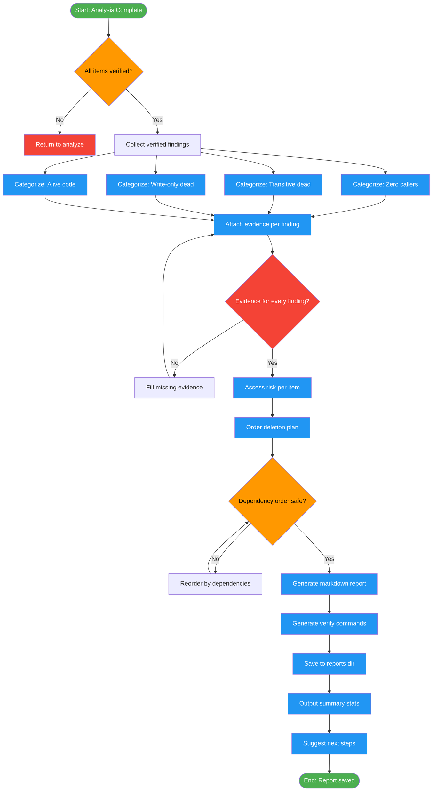

<!-- diagram-meta: {"source": "commands/dead-code-report.md", "source_hash": "sha256:4c9a4a0311565c6bde7d7c8a6c97634875b3fb089fce95c8a9973717dd8f7726", "generated_at": "2026-02-19T00:00:00Z", "generator": "generate_diagrams.py"} -->
# Diagram: dead-code-report

Generate a comprehensive dead code report with categorized findings, evidence, risk assessment, and an ordered implementation plan for safe deletion. Runs after `/dead-code-analyze`.

## Legend

| Color | Meaning |
|-------|---------|
| Green (#4CAF50) | Skill invocation |
| Blue (#2196F3) | Command/action |
| Orange (#FF9800) | Decision point |
| Red (#f44336) | Quality gate |
