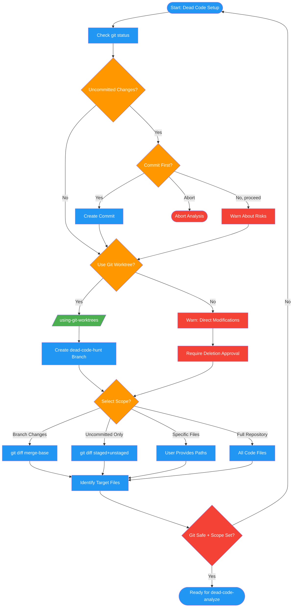

<!-- diagram-meta: {"source": "commands/dead-code-setup.md", "source_hash": "sha256:d0a19df4171dd31fbf3ad3314f1882dde6454c4dc8a84fae8c81bcb6cac21417", "generated_at": "2026-02-19T00:00:00Z", "generator": "generate_diagrams.py"} -->
# Diagram: dead-code-setup

Git safety checks and scope selection for dead code analysis.

## Legend

| Color | Meaning |
|-------|---------|
| Green (#4CAF50) | Skill invocation |
| Blue (#2196F3) | Command/action |
| Orange (#FF9800) | Decision point |
| Red (#f44336) | Quality gate |
