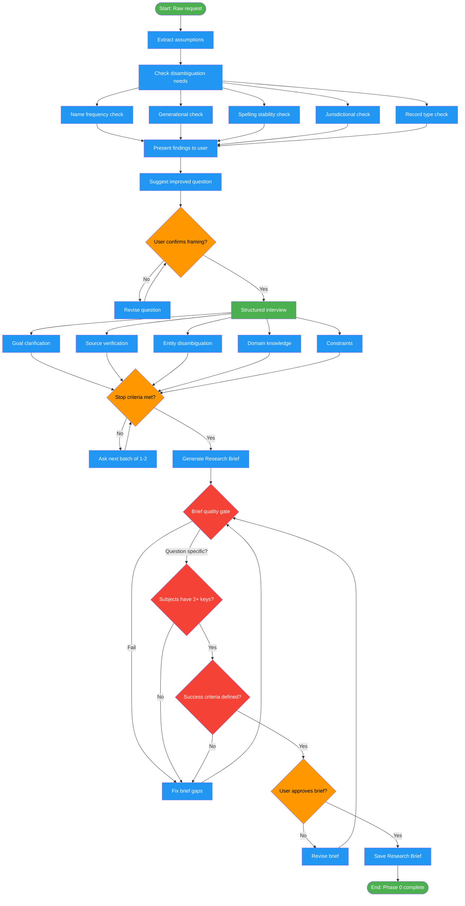

<!-- diagram-meta: {"source": "commands/deep-research-interview.md", "source_hash": "sha256:8537e8444ffb5ec37986b346481ebdf11deb77d14de3c4c2dc3da1e47d439427", "generated_at": "2026-02-19T00:00:00Z", "generator": "generate_diagrams.py"} -->
# Diagram: deep-research-interview

Transform a raw research request into a Research Brief through assumption extraction, disambiguation, structured interview across five categories, and quality-gated brief generation.

## Legend

| Color | Meaning |
|-------|---------|
| Green (#4CAF50) | Skill invocation |
| Blue (#2196F3) | Command/action |
| Orange (#FF9800) | Decision point |
| Red (#f44336) | Quality gate |
