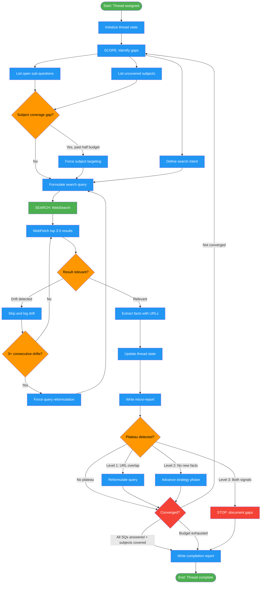

<!-- diagram-meta: {"source": "commands/deep-research-investigate.md", "source_hash": "sha256:3ea231bffb3419088aae88ece44d0e94b00003d481e1407c4bbf60af1e1bfe35", "generated_at": "2026-02-19T00:00:00Z", "generator": "generate_diagrams.py"} -->
# Diagram: deep-research-investigate

Execute iterative web research for a single thread using the Triplet Engine (Scope, Search, Extract) with plateau detection, drift guards, and micro-report generation each round.

## Legend

| Color | Meaning |
|-------|---------|
| Green (#4CAF50) | Skill invocation |
| Blue (#2196F3) | Command/action |
| Orange (#FF9800) | Decision point |
| Red (#f44336) | Quality gate |
