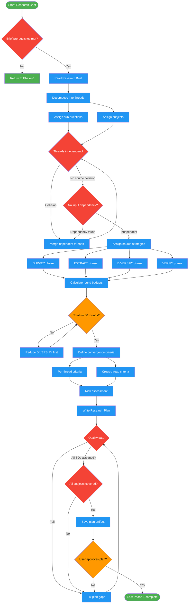

<!-- diagram-meta: {"source": "commands/deep-research-plan.md", "source_hash": "sha256:15759e4cb96797d42744fe35ae69f0a5216f4916447db1fd257f1834017e66e3", "generated_at": "2026-02-19T00:00:00Z", "generator": "generate_diagrams.py"} -->
# Diagram: deep-research-plan

Decompose a Research Brief into independent parallel threads with source strategies, round budgets, convergence criteria, and risk assessment. Planning only, no searching.

## Legend

| Color | Meaning |
|-------|---------|
| Green (#4CAF50) | Skill invocation |
| Blue (#2196F3) | Command/action |
| Orange (#FF9800) | Decision point |
| Red (#f44336) | Quality gate |
