<!-- diagram-meta: {"source": "commands/design-assessment.md", "source_hash": "sha256:c437fd77190637e717c5fe4e2cbec19d3fe332a3e65f28a55adeb03aeb40e88a", "generated_at": "2026-02-19T00:00:00Z", "generator": "generate_diagrams.py"} -->
# Diagram: design-assessment

Generate assessment frameworks (dimensions, severity levels, verdicts, finding schemas) for evaluative skills and commands.

```mermaid
flowchart TD
    Start([Start]) --> ParseInputs[Parse Inputs]
    ParseInputs --> HasType{Type Provided?}
    HasType -->|Yes| UseType[Use Explicit Type]
    HasType -->|No| AutoDetect[Auto-Detect Type]
    AutoDetect --> DetectPatterns[Match Detection Patterns]
    DetectPatterns --> AnnounceType[Announce Target Type]
    UseType --> AnnounceType
    AnnounceType --> ModeCheck{Mode?}
    ModeCheck -->|Autonomous| DefaultDims[Use Default Dimensions]
    ModeCheck -->|Interactive| DimMenu[Present Dimension Menu]
    DimMenu --> UserSelect{Dimensions Selected?}
    UserSelect -->|Yes| ValidateDims[Validate Selection]
    UserSelect -->|No| DimMenu
    ValidateDims --> MinCheck{Min 1 Dimension?}
    MinCheck -->|No| DimMenu
    MinCheck -->|Yes| GenFramework
    DefaultDims --> GenFramework[Generate Framework]
    GenFramework --> GenDimTable[Generate Dimension Table]
    GenDimTable --> GenSeverity[Generate Severity Levels]
    GenSeverity --> GenConfidence[Generate Confidence Levels]
    GenConfidence --> GenSchema[Generate Finding Schema]
    GenSchema --> GenVerdict[Generate Verdict Logic]
    GenVerdict --> GenScorecard[Generate Scorecard]
    GenScorecard --> GenGate[Generate Quality Gate]
    GenGate --> Reflection{Reflection Gate}
    Reflection -->|All Present| Output[Display Framework]
    Reflection -->|Missing| Fix[Fix Missing Sections]
    Fix --> Reflection
    Output --> Done([End])

    style Start fill:#4CAF50,color:#fff
    style Done fill:#4CAF50,color:#fff
    style HasType fill:#FF9800,color:#fff
    style ModeCheck fill:#FF9800,color:#fff
    style UserSelect fill:#FF9800,color:#fff
    style MinCheck fill:#FF9800,color:#fff
    style Reflection fill:#f44336,color:#fff
    style ParseInputs fill:#2196F3,color:#fff
    style AutoDetect fill:#2196F3,color:#fff
    style DetectPatterns fill:#2196F3,color:#fff
    style AnnounceType fill:#2196F3,color:#fff
    style GenFramework fill:#2196F3,color:#fff
    style GenDimTable fill:#2196F3,color:#fff
    style GenSeverity fill:#2196F3,color:#fff
    style GenConfidence fill:#2196F3,color:#fff
    style GenSchema fill:#2196F3,color:#fff
    style GenVerdict fill:#2196F3,color:#fff
    style GenScorecard fill:#2196F3,color:#fff
    style GenGate fill:#2196F3,color:#fff
    style Output fill:#2196F3,color:#fff
```

## Legend

| Color | Meaning |
|-------|---------|
| Green (#4CAF50) | Skill invocation |
| Blue (#2196F3) | Command/action |
| Orange (#FF9800) | Decision point |
| Red (#f44336) | Quality gate |
