<!-- diagram-meta: {"source": "commands/distill-session.md", "source_hash": "sha256:9062ad6b4bb37f6058000b5f42466b5b9ca9d1fa7b3739c3ee1840b4a7a254e2", "generated_at": "2026-02-19T00:00:00Z", "generator": "generate_diagrams.py"} -->
# Diagram: distill-session

Extract context from an oversized session through chunked parallel summarization, artifact verification, planning document discovery, and synthesis into a resumable boot prompt.

```mermaid
flowchart TD
  Start([Start: Session too large]) --> ListSessions[List project sessions]

  style Start fill:#4CAF50,color:#fff
  style ListSessions fill:#2196F3,color:#fff

  ListSessions --> NameMatch{Exact name match?}

  style NameMatch fill:#FF9800,color:#000

  NameMatch -->|Yes| AutoSelect[Auto-select session]
  NameMatch -->|No| PresentOptions[Present options to user]

  style AutoSelect fill:#2196F3,color:#fff
  style PresentOptions fill:#2196F3,color:#fff

  PresentOptions --> UserPick{User selects session}

  style UserPick fill:#FF9800,color:#000

  AutoSelect --> GetCompact[Get last compact summary]
  UserPick --> GetCompact

  style GetCompact fill:#2196F3,color:#fff

  GetCompact --> CalcChunks[Calculate chunk boundaries]

  style CalcChunks fill:#2196F3,color:#fff

  CalcChunks --> ExtractChunks[Extract session chunks]

  style ExtractChunks fill:#2196F3,color:#fff

  ExtractChunks --> SpawnAgents[Spawn parallel summarizers]

  style SpawnAgents fill:#4CAF50,color:#fff

  SpawnAgents --> CollectSummaries[Collect from agent files]

  style CollectSummaries fill:#2196F3,color:#fff

  CollectSummaries --> FailCheck{> 20% failures?}

  style FailCheck fill:#f44336,color:#fff

  FailCheck -->|Yes| Abort[Abort with error]
  FailCheck -->|No| VerifyArtifacts[Verify file state]

  style Abort fill:#f44336,color:#fff
  style VerifyArtifacts fill:#2196F3,color:#fff

  VerifyArtifacts --> CompareToExpected{Matches plan expectations?}

  style CompareToExpected fill:#FF9800,color:#000

  CompareToExpected -->|Mismatch| FlagDiscrep[Flag discrepancies]
  CompareToExpected -->|OK| FindPlanDocs[Search planning documents]

  style FlagDiscrep fill:#2196F3,color:#fff

  FlagDiscrep --> FindPlanDocs

  style FindPlanDocs fill:#2196F3,color:#fff

  FindPlanDocs --> SearchPlans[Search plans directory]
  FindPlanDocs --> SearchRefs[Search chunk summaries]
  FindPlanDocs --> SearchProj[Search project for plans]

  style SearchPlans fill:#2196F3,color:#fff
  style SearchRefs fill:#2196F3,color:#fff
  style SearchProj fill:#2196F3,color:#fff

  SearchPlans --> DocsFound{Planning docs found?}
  SearchRefs --> DocsFound
  SearchProj --> DocsFound

  style DocsFound fill:#FF9800,color:#000

  DocsFound -->|Yes| ReadDocs[Read and extract progress]
  DocsFound -->|No| ExplicitNone[Write NO PLANNING DOCS]

  style ReadDocs fill:#2196F3,color:#fff
  style ExplicitNone fill:#2196F3,color:#fff

  ReadDocs --> GenVerify[Generate verify commands]
  ExplicitNone --> GenVerify

  style GenVerify fill:#2196F3,color:#fff

  GenVerify --> GenResume[Generate resume commands]

  style GenResume fill:#2196F3,color:#fff

  GenResume --> SpawnSynth[Spawn synthesis agent]

  style SpawnSynth fill:#4CAF50,color:#fff

  SpawnSynth --> SynthGate{Section 0 at top?}

  style SynthGate fill:#f44336,color:#fff

  SynthGate -->|No| FixSynth[Fix output structure]
  SynthGate -->|Yes| SkillGate{Skill call in 0.1?}

  style FixSynth fill:#2196F3,color:#fff

  FixSynth --> SynthGate

  style SkillGate fill:#f44336,color:#fff

  SkillGate -->|Missing| FixSynth
  SkillGate -->|Present or N/A| PathGate{All paths absolute?}

  style PathGate fill:#f44336,color:#fff

  PathGate -->|No| FixSynth
  PathGate -->|Yes| WriteOutput[Write distilled file]

  style WriteOutput fill:#2196F3,color:#fff

  WriteOutput --> ReportDone[Report completion path]

  style ReportDone fill:#2196F3,color:#fff

  ReportDone --> End([End: Distillation saved])

  style End fill:#4CAF50,color:#fff
```

## Legend

| Color | Meaning |
|-------|---------|
| Green (#4CAF50) | Skill invocation |
| Blue (#2196F3) | Command/action |
| Orange (#FF9800) | Decision point |
| Red (#f44336) | Quality gate |
