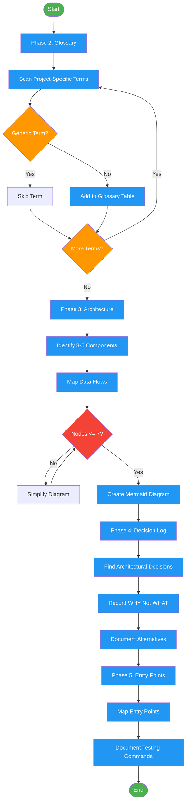

<!-- diagram-meta: {"source": "commands/encyclopedia-build.md", "source_hash": "sha256:381a68eecb97664a9e71fa8f2e4d55d6c365ade70f8b93075e28c75026c467e9", "generated_at": "2026-02-19T00:00:00Z", "generator": "generate_diagrams.py"} -->
# Diagram: encyclopedia-build

Build encyclopedia content: glossary, architecture skeleton, decision log, and entry points (Phases 2-5).

## Legend

| Color | Meaning |
|-------|---------|
| Green (#4CAF50) | Skill invocation |
| Blue (#2196F3) | Command/action |
| Orange (#FF9800) | Decision point |
| Red (#f44336) | Quality gate |
