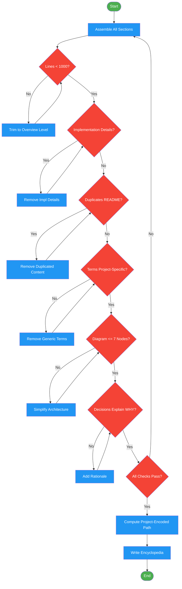

<!-- diagram-meta: {"source": "commands/encyclopedia-validate.md", "source_hash": "sha256:c8e8b208b33b58fd87bd2a75f88fd02a2ee6377cdc85b5f37ebb732605335139", "generated_at": "2026-02-19T00:00:00Z", "generator": "generate_diagrams.py"} -->
# Diagram: encyclopedia-validate

Assemble and validate encyclopedia content, then write to the output path (Phase 6).

## Legend

| Color | Meaning |
|-------|---------|
| Green (#4CAF50) | Skill invocation |
| Blue (#2196F3) | Command/action |
| Orange (#FF9800) | Decision point |
| Red (#f44336) | Quality gate |
