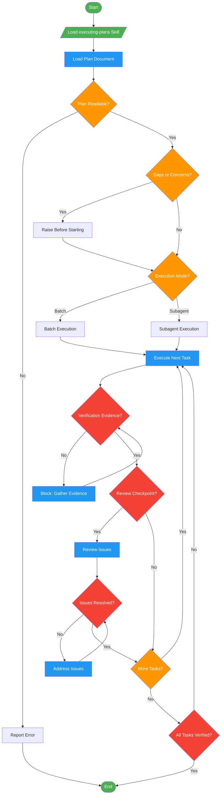

<!-- diagram-meta: {"source": "commands/execute-plan.md", "source_hash": "sha256:4d9f434d63f49ad20b208b8faceaae810e2bcd97e26283313c1919485a44ce46", "generated_at": "2026-02-19T00:00:00Z", "generator": "generate_diagrams.py"} -->
# Diagram: execute-plan

Execute implementation plans with structured review checkpoints via the executing-plans skill.

## Legend

| Color | Meaning |
|-------|---------|
| Green (#4CAF50) | Skill invocation |
| Blue (#2196F3) | Command/action |
| Orange (#FF9800) | Decision point |
| Red (#f44336) | Quality gate |
