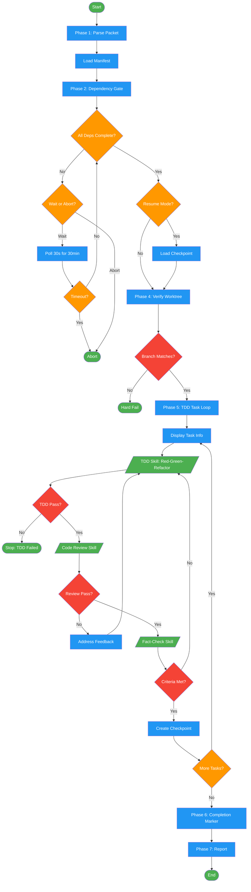

<!-- diagram-meta: {"source": "commands/execute-work-packet.md", "source_hash": "sha256:5998cc1bb0df7dff5150fd2b4eff9e7289f9a3d250154c6925a191b1f6235c01", "generated_at": "2026-02-19T00:00:00Z", "generator": "generate_diagrams.py"} -->
# Diagram: execute-work-packet

Execute a single work packet: parse, check dependencies, run TDD tasks with review and fact-check gates, then mark complete.

## Legend

| Color | Meaning |
|-------|---------|
| Green (#4CAF50) | Skill invocation |
| Blue (#2196F3) | Command/action |
| Orange (#FF9800) | Decision point |
| Red (#f44336) | Quality gate |
