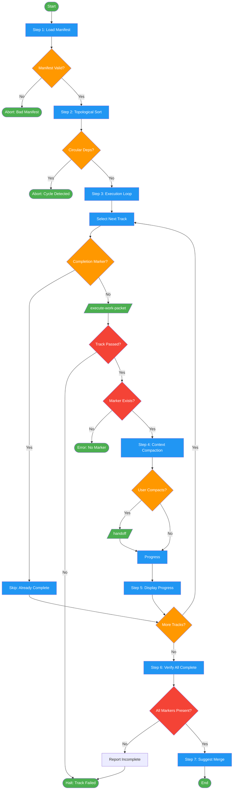

<!-- diagram-meta: {"source": "commands/execute-work-packets-seq.md", "source_hash": "sha256:f443576862b20f62e1fcb11ae118315eb81b61fee6d213f5ef3b9907f569f058", "generated_at": "2026-02-19T00:00:00Z", "generator": "generate_diagrams.py"} -->
# Diagram: execute-work-packets-seq

Execute all work packets in dependency order, one at a time, with context compaction between tracks.

## Legend

| Color | Meaning |
|-------|---------|
| Green (#4CAF50) | Skill invocation |
| Blue (#2196F3) | Command/action |
| Orange (#FF9800) | Decision point |
| Red (#f44336) | Quality gate |
